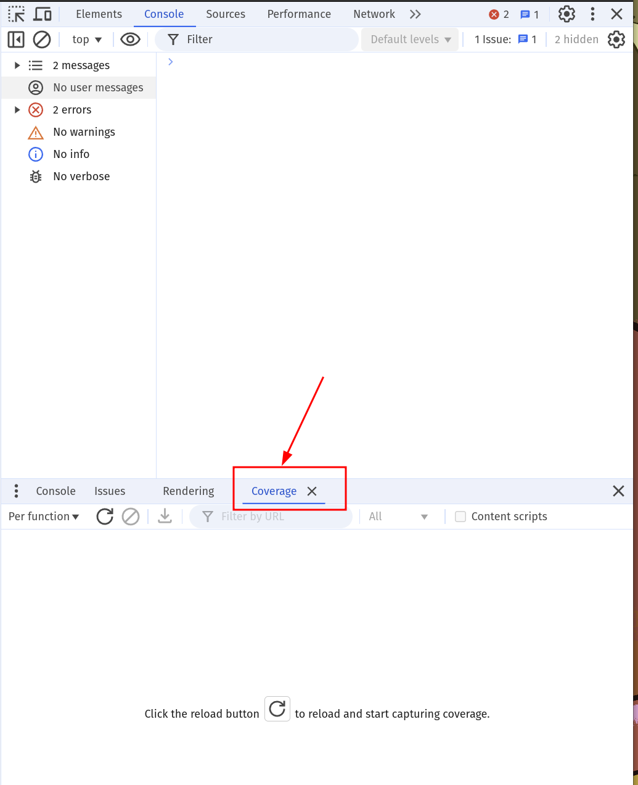
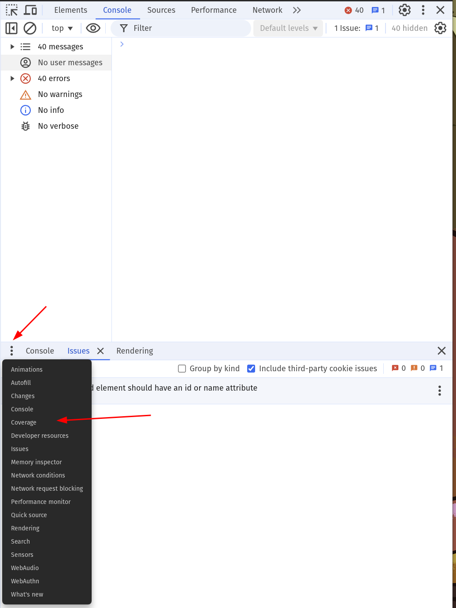
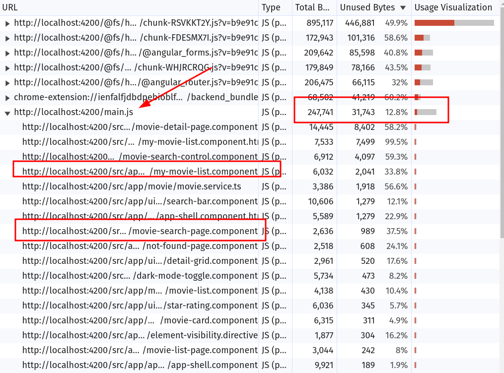
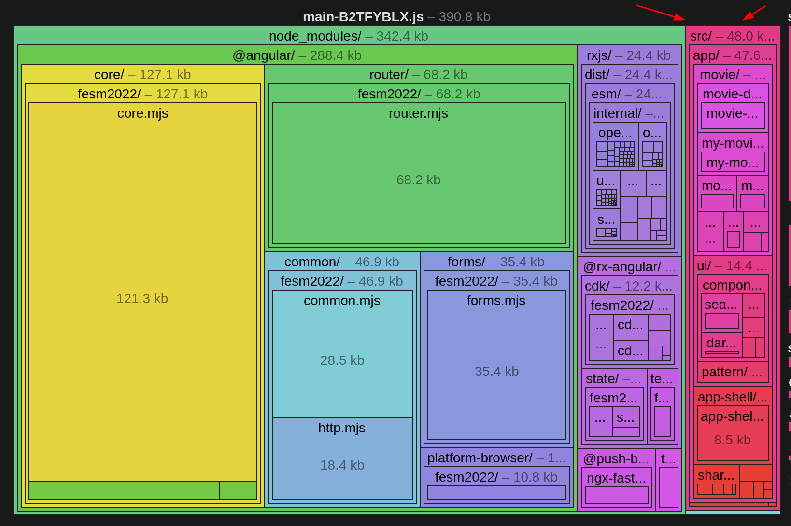

# Bundle Analysis: Coverage & Bundle Analyzer

In this exercise we will get to know tools to analyse the generated bundles
and the code coverage of our application.
This helps us to further improve the LCP by finding candidates that should
not be part of the initial chunk that is downloaded.

## 1. Code Coverage Audit

The first step you should always do is to perform a `code coverage` report. Open
the chrome dev tools and navigate to the `Coverage` tab. It's most probably
part of your bottom pane.

Press the `ESC` button to open the bottom pane to find the `Coverage` tab.



If you can't find the `Coverage` tab right away,
it's hidden behind the `3-dot` menu on the left.



Now run a code coverage report on any given URl you are interested in.
You can perform it on the `/list/popular` page and for comparison on a movie detail route.

You should be able to spot the `main.js` chunk. Expand it to see its contents.
You should immediately spot things that should not be part of the initial bundle.



Great! Keep your findings somewhere to compare it afterwards against the improvements
you will achieve with further exercises.

If you like, do more audits or investigate the results more. 

## 2. Bundle analysis

To get even more details about the generated bundles,
we can use the [`esbuild bundle analyzer`](https://esbuild.github.io/analyze/).

In order to generate the needed output, generate a production build:

```shell
ng build --stats-json
```

The build also tells you about the `initial chunk files`. Those are the ones that
are added into the `index.html` and will always be fetched immediately. 

```shell
Initial chunk files | Names         |  Raw size | Estimated transfer size
main-B2TFYBLX.js    | main          | 400.16 kB |               102.56 kB
styles-35BWNFGI.css | styles        |   8.52 kB |                 2.11 kB

                    | Initial total | 408.68 kB |               104.66 kB
```

The bundle names of the initial chunks are important. In our tiny example, it's only a single
bundle - but you can have several 100 chunks in enterprise grade applications.

We only want to focus on the `initial chunk files` for an analysis like this.

The build now produces a `dist/ws-ng-perf/stats.json`.

Upload the generated file to the [esbuild bundle analyzer](https://esbuild.github.io/analyze/) and
inspect the result.

Here you get presented a `tree map` of the bundle. Feel free to spend some time on
digging into the chart.

The tree map shows you the exact same bundles as mentioned by the build output.
You should be able to spot the code that we consider as `1st party`.



Go ahead and open it up! You will see that essentially all our code is part of that bundle.

Save that stats.json somewhere to have a basis for future comparisons!


