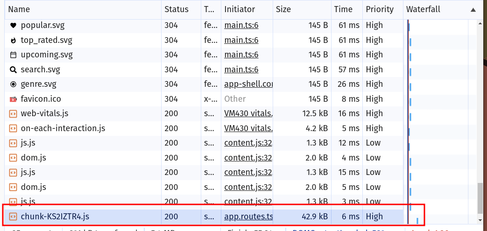
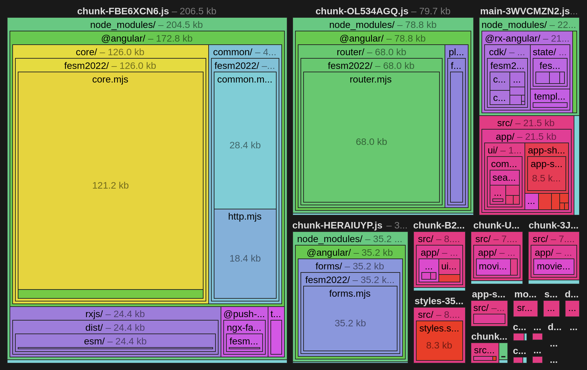

# Bundle Analysis: Lazy Loading

In this exercise we will apply the most basic techniques to achieve a bundle size improvement
which ultimately helps us to optimize our LCP.

## 1. Lazy Load Routes

Open the `app.routes.ts` and apply lazy loading for basically all components you think
are worth to lazy load.

I recommend the following components:

* `MovieDetailPageComponent`
* `MovieSearchPageComponent`
* `MyMovieListComponent`
* `NotFoundPageComponent`

You essentially have to switch from `component: Component` to `loadComponent: () => import('path/to/component').then(m => m.Component)`.

<details>
  <summary>Full Router Config w/ lazy loading</summary>

```ts

import { Routes } from '@angular/router';

import { MovieListPageComponent } from './movie/movie-list-page/movie-list-page.component';

export const routes: Routes = [
  {
    path: 'list/:category',
    component: MovieListPageComponent,
  },
  {
    path: 'list/genre/:id',
    component: MovieListPageComponent,
  },
  {
    path: 'movie/:id',
    loadComponent: () =>
      import('./movie/movie-detail-page/movie-detail-page.component').then(
        (m) => m.MovieDetailPageComponent,
      ),
  },
  {
    path: 'search/:query',
    loadComponent: () =>
      import('./movie/movie-search-page/movie-search-page.component').then(
        (m) => m.MovieSearchPageComponent,
      ),
  },
  {
    path: 'my-movies',
    loadComponent: () =>
      import('./movie/my-movie-list/my-movie-list.component').then(
        (m) => m.MyMovieListComponent,
      ),
  },
  {
    path: '',
    redirectTo: 'list/popular',
    pathMatch: 'full',
  },
  {
    path: '**',
    loadComponent: () =>
      import('./not-found-page/not-found-page.component').then(
        (m) => m.NotFoundPageComponent,
      ),
  },
];


```

</details>


## 2. Measure the result

Make sure to measure the outcome you've gained.

### 2.0 Run the app

First of all, run the application and see if the lazy loading works.

The serve output should already tell you about `Lazy chunk files`.

```shell
Lazy chunk files    | Names                       |  Raw size
chunk-KS2IZTR4.js   | my-movie-list-component     |  18.94 kB | 
chunk-3XJTKJZR.js   | movie-detail-page-component |  16.76 kB | 
chunk-2YGA2JM7.js   | movie-search-page-component |   2.19 kB | 
chunk-GWMDG7XN.js   | not-found-page-component    |   2.12 kB |
```

Now inspect the application with the network tab being open. When navigating to a lazy loaded route
you should see the new chunk getting downloaded. Initiated by the `app.routes.ts`



### 2.1 Coverage Audit

Now run a code coverage report on any given URl you are interested in.
You can perform it on the `/list/popular` page and for comparison on a movie detail route.

You should be able to spot the `main.js` chunk. Expand it to see its contents.

Compare it to the result you've saved from the exercise before! 

### 2.2 Bundle Analyzer

Create a new build with a stats.json.

```shell
ng build --stats-json
```

The build now produces a `dist/ws-ng-perf/stats.json`.

The build also gives u an information about the new initial chunks that now are generated. You'll notice 
they can get quite a lot with only little changes being made. That's because esbuild code-splitting is so aggressive 
and there is no real control over it.

```shell
Initial chunk files | Names                       |  Raw size | Estimated transfer size
chunk-FBE6XCN6.js   | -                           | 211.50 kB |                60.00 kB
chunk-OL534AGQ.js   | -                           |  81.62 kB |                20.41 kB
main-3WVCMZN2.js    | main                        |  46.21 kB |                12.90 kB
chunk-HERAIUYP.js   | -                           |  36.44 kB |                 7.52 kB
chunk-B2SZMA44.js   | -                           |   8.85 kB |                 2.78 kB
styles-35BWNFGI.css | styles                      |   8.52 kB |                 2.11 kB
chunk-45SB5QLJ.js   | -                           |   3.20 kB |                 1.32 kB

                    | Initial total               | 396.34 kB |               107.04 kB

Lazy chunk files    | Names                       |  Raw size | Estimated transfer size
chunk-UTAZ77VJ.js   | movie-detail-page-component |   8.05 kB |                 2.47 kB
chunk-3JICOTOI.js   | my-movie-list-component     |   7.97 kB |                 2.62 kB
chunk-GMT6H2GX.js   | not-found-page-component    | 913 bytes |               913 bytes
chunk-2X4PNEYA.js   | movie-search-page-component | 862 bytes |               862 bytes
```

Anyway, make sure to remember some of the file names so you have an easier time inspecting
the stats.json.

Upload the generated file to the [esbuild bundle analyzer](https://esbuild.github.io/analyze/) and
inspect the result.

There should be a lot more to inspect now ;). And you also should notice that the `initial total` now has decreased a bit!


