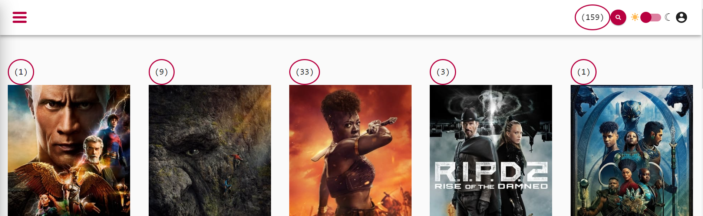

# ChangeDetectionStrategy DirtyCheck Exercises

In this exercise we will focus on basic runtime optimizations in angular applications by using our knowledge about
the `ChangeDetection` system in angular. Before we can do any optimization, let's get a picture of the current state.

We will create a little helper component that will assist us to debug change detection cycles in our application.

## 1. Create a dirty checks component

Your task is to create a `DirtyChecksComponent` which should serve as a performance debug utility.
Whenever the application renders, it should increase a number in its template.

Create it in the `/src/app/shared` folder.

```bash
# generate component
ng g c shared/dirty-check
```

The component should have a `checked: Signal<number>` as a field and bind it in the template.

Use the following skeleton:

```ts
import { Component, signal } from '@angular/core';

@Component({
  selector: 'dirty-check',
  standalone: true,
  template: ` <code class="dirty-checks">({{ checked() }})</code> `,
  styles: [
    `
      :host {
        display: inline-block;
        border-radius: 100%;
        border: 2px solid var(--palette-secondary-main);
        padding: 1rem;
        font-size: var(--text-lg);
      }
    `,
  ]
})
export class DirtyCheckComponent {
  checked = signal(0);
}

```

## 2. Implement dirty check logic

Now it's time to build a simple logic to determine if the component got checked or not. Whenever change detection runs,
we want the `checked` signal to increase its value.

For this to work, use the `ngDoCheck` Lifecycle hook. You need to let `DirtyCheckComponent` implement the `DoCheck` interface.

Whenever the `ngDoCheck` lifecycle hook runs, just increase the value of the signal.

<details>
    <summary>Dirty Checking</summary>

```typescript
// src/app/shared/dirty-check.component.ts

import {Component, DoCheck} from "@angular/core";

@Component(/**/)
export class DirtyCheckComponent implements DoCheck {
  checked = signal(0);

  ngDoCheck() {
    this.checked.update(c => c + 1);
  }
}
```
</details>

## 3. Use the dirty-check component

Afterward, use the `<dirty-check />` in multiple components to visualize their respective amount
of dirty checks while the application is running.

After each usage, go and check your application and see numbers going wild when interacting with the app.

### 3.1 Use in `AppComponent` template 

Add import in `app.component.ts` and include it in the imports section

```typescript
// Include dirty checks component import here.

import {DirtyCheckComponent} from "./shared/dirty-check/dirty-check.component";

@Component({
    selector: 'app-root',
    standalone: true,                                // 👇️
    imports: [RouterOutlet, AppShellComponent, DirtyCheckComponent],
  // ...
})
```

Add `<dirty-check />` component in `app.component.ts` template:

```html
template: `
<app-shell>
  <!-- Add dirty checks here -->
  <dirty-check />
  <router-outlet />
</app-shell>
`,
```

### 3.2 Use in `MovieListPageComponent` & `MovieCardComponent`

Repeat the steps done in `AppComponent`, but for more components. You can choose to put it everywhere if you like :).



## 4. Evaluate initial state of the application

Serve your app and try to interact with the page. You will see counter always go up.
Perform different kinds of actions and note how the counter will increase by different amounts.

* navigate
  * between categories
  * movie-detail
* tilt
* switch dark/light mode

