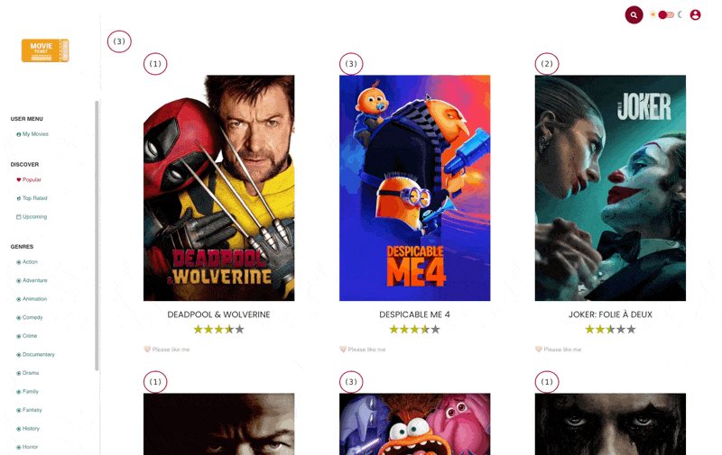

# ChangeDetection - Signals Exercise

This exercise is here to showcase how powerful signal change detection is. We are not quite at the level
we get with signal components, but we are close to it already.

## TiltDirective signal CD

We are going to slightly adjust the `TiltDirective` in order to make use of the new signal based
change detection.

Open the `TiltDirective` and..

**1. Transform `rotate` into a signal**

Refactor the `rotate` field from a static property to a `signal()`. Set the initial value to `rotate(0deg)`
Update all the code that updates the `rotate` field to use the signal `set` or `update` apis.

<details>
  <summary>TiltDirective rotate signal</summary>

```diff
// tilt.directive.ts

- rotate = 'rotate(0deg)';
+ rotation = signal('rotate(0deg)');
```

```diff
merge(rotate$, reset$).subscribe((rotate) => {
- this.rotate = rotate;
+ this.rotation.set(rotate);
});
```

</details>

**2. Update host binding to call the signal**

In order for everything to work, we need to call the signal in the host binding.

<details>
  <summary>TiltDirective use signal in {host} decorator style</summary>

```ts
// tilt.directive.ts

@Directive({
  selector: '[tilt]',
  standalone: true,
  host: {
    '[style.transform]': 'rotate()' // <-- update this line
  }
})
export class TiltDirective {
  //...
}


```

</details>

**3. Remove markForCheck call**

Because we are using signals, we don't need to call `markForCheck` anymore. Change detection should just work.


<details>
  <summary>TiltDirective remove markForCheck</summary>

```diff
// tilt.directive.ts

@Directive(...)
export class TiltDirective {
  constructor(private elementRef: ElementRef<HTMLElement>) {
    // ...
    merge(rotate$, reset$).subscribe((rotate) => {
      this.rotation.set(rotate);
-     this.cdr.markForCheck(); // <-- remove this line
    });
  }
}
```

</details>


Great! Please take a look at your application and be amazed by the change detection counters.
🔥🔥🔥🔥


<details>
  <summary>Signals ChangeDetection result</summary>

#### Explanation:
- The TiltDirective uses a signal to update the rotation value
- Because nothing is being marked for check, the `AppComponent` is not dirty checked (the counter doesn't increase anymore)
- The `MovieCardComponent` is refreshed (the counter increases) because a signal was updated
- 🎉 This means we can refresh child components without refreshing any parent component (Local Change Detection)!



</details>


## Check out Matthieu Riegler's Demo !!!

https://jeanmeche.github.io/angular-change-detection/
