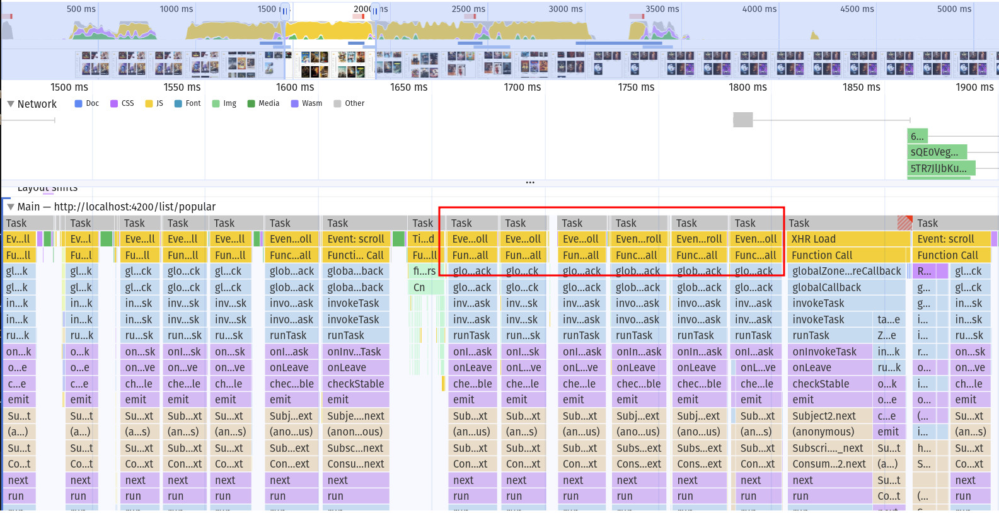
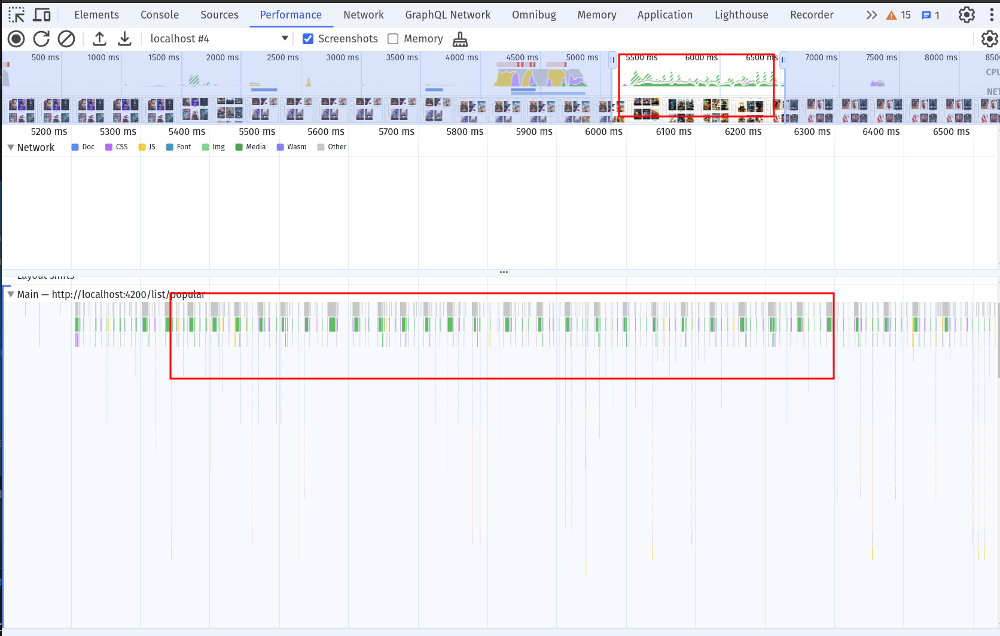
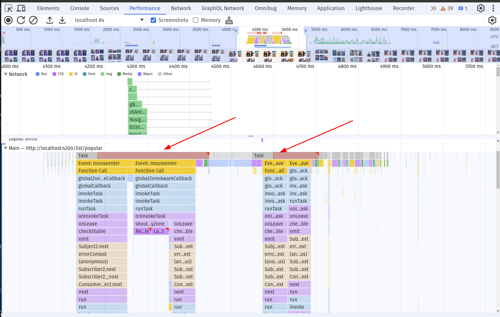

# ChangeDetectionStrategy zone.js optimizations

In this exercise we will focus on advanced runtime optimizations in angular applications by using our knowledge about
the `ChangeDetection` system and `NgZone` in angular.

## Goal

The goal of this exercise is to give you a deeper understanding of the `ChangeDetection` system in angular and how it
is connected to `NgZone`. We will learn how to optimize our applications runtime performance by using advanced techniques
to minimize the `ChangeDetection` cycles of our application.

## 0. Measure the current state

With the `dirty-check` component in place we can tell how often change detection runs for certain
components.

By far the hardest hitting issue we have on the page is that the scroll event listener inside
the `/shared/cdk/element-visibility/element-visibility.directive.ts` is triggering NgZone
all the time.

Scroll on the page and see how the change detection counter increases dramatically over time.

Also perform a performance recording of the scroll interaction. You'll see how the scroll
event causes a massive amount of scripting time.



## 1. Run the scroll event out of NgZone

Your task is to make sure the scroll event doesn't trigger zone all the time. You can choose whatever way you like, the simplest one for now 
will be to use the `NgZone#runOutsideAngular` method.

1. Go in the `element-visibility.directive.ts`
2. inject `NgZone` (`private zone = inject(NgZone);`)
3. use the `zone.runOutsideAngular()` method to wrap the scroll subscription


<details>
  <summary>Run scroll out of NgZone</summary>

```ts

// /shared/cdk/element-visibility/element-visibility.directive.ts

private zone = inject(NgZone); // 👈️👈️👈️

constructor() {
  this.zone.runOutsideAngular(() => { // 👈️👈️👈️
    fromEvent(document, 'scroll')
      .pipe(
        filter(() => !!document.scrollingElement),
        map(() => {
          const { scrollTop, clientHeight } = document.scrollingElement!;
          return (
            scrollTop + clientHeight + 100 >=
            this.elementRef.nativeElement.offsetTop
          );
        }),
        filter(Boolean),
      )
      .subscribe(() => this.elementVisible.emit());
  });
}
```

</details>

Great job! Check your application and see how your cd counter drops.

Please also test if the infinite scroller actually still works ;).

Do a performance recording again and see the massive performance improvement from this change!



## 2. Fix the issue -> re-enter NgZone

You should have encountered an issue that you might know from your experience. The famous: I have to do _something_ on the
page in order to make changes being detected.

This time, it is because we are actually missing out a cd cycle. Whenever we `emit` a new value to the outside world, we should
re-enter NgZone in order to let it know it should run change detection for this event.

### 2.1 Measure it!

Try scrolling without touching a movie tile. Nothing will happen as soon as hover over one of the
cards. The reason is that the hover events are also patched by NgZone - so it kicks in at this point
in time.

You can also see this in the flame chart analysis. Do a recording and see how NgZone kicks in
on the hover event. Try to understand what components are involved here.



### 2.2 Fix it!

Use the `ngZone.run` method to wrap the `elementVisible.emit` event emission.

<details>
  <summary>Re-enter NgZone for event emission</summary>

```ts

// /shared/cdk/element-visibility/element-visibility.directive.ts

private zone = inject(NgZone);

constructor() {
  this.zone.runOutsideAngular(() => {
    fromEvent(document, 'scroll')
      .pipe(
        filter(() => !!document.scrollingElement),
        map(() => {
          const { scrollTop, clientHeight } = document.scrollingElement!;
          return (
            scrollTop + clientHeight + 100 >=
            this.elementRef.nativeElement.offsetTop
          );
        }),
        filter(Boolean),
      )
      .subscribe(() => {
        this.zone.run(() => { // 👈️👈️👈️
          this.elementVisible.emit()
        });
      });
  });
}
```

</details>

Well done! You've improved the application already a lot :) Make sure the infinite scroll is working as intended now.

As always, do a measurement to confirm your improvement!
