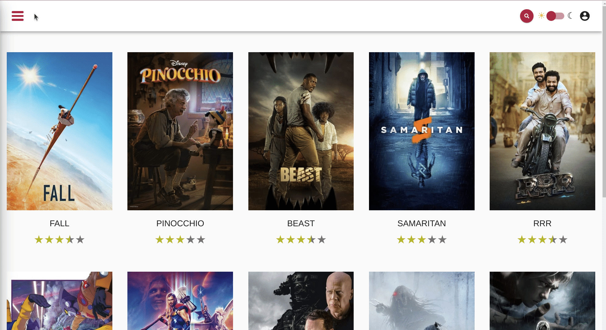
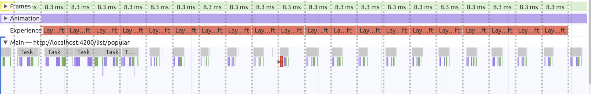
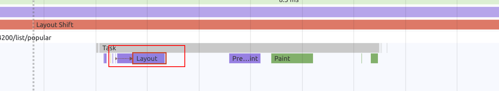
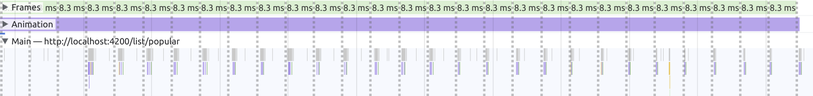
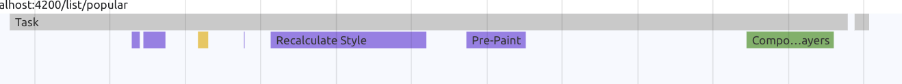

# CSS Performance - Compositor only animations

In this exercise you will learn how to spot badly implemented animations and how to improve their performance.

So far we've implemented solutions that avoid javascript accessing the DOM by using observers to get
push notifications about DOM changes.
Yet, these strategies don't apply to every problem. In this exercise we will learn how to improve the
performance of css animations by using compositor only properties.


## 1. Compositor only sidebar

### 0.1 Measure current state

Start off by measuring the current state of the sidebar slide animation.

**Animation**


You should notice two things when analysing the performance recording

**1. Layout Shift**


While the animation is ongoing, you'll notice a lot of `layout shifts` being reported by the chrome dev tools.

**2. Layout Thrashing**


The animation causes multiple consequent `layout` tasks while it is ongoing.

### 1.1 introduce compositor only animation

Your task is to find the root cause of the issue and to solve it. Right now, the animation is done
by animating the `left` property from `-250px` to `0`. This moves the sidebar in place.

Implement your changes in `side-drawer.component.scss` as this is the place where the animation is implemented originally.

> `left` is a layout property, thus causing layout shifts and layout tasks for the browser
> 
> `transform: translateX` is also capable of moving things on the `X` axis, but is a `compositor only` propery 

<details>
  <summary>Show Help</summary>

```scss
// src/app/ui/component/side-drawer/side-drawer.component.scss

.side-drawer {
  /*
  * other stuff
  */
  left: -250px;
  transform: translateX(-100%);
}

@media screen and (min-width: 1298px) {
  .side-drawer {
    //left: 0;
    transform: translateX(0);
  }
}
.side-drawer.opened {
  //left: 0;
  transform: translateX(0);
}

```

</details>

Great! 

### 1.2 Measure improvement

When you've finished implementing your improvements, make sure to measure
the outcome again.

You should see both before mentioned issues being gone.

**1. No layout shifts**


**2. No layout task**



