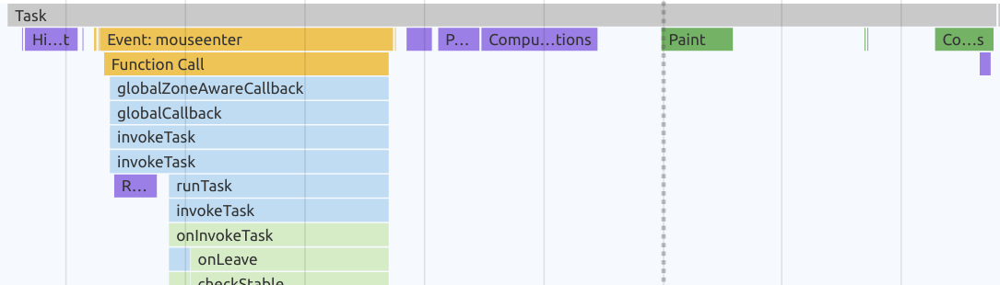
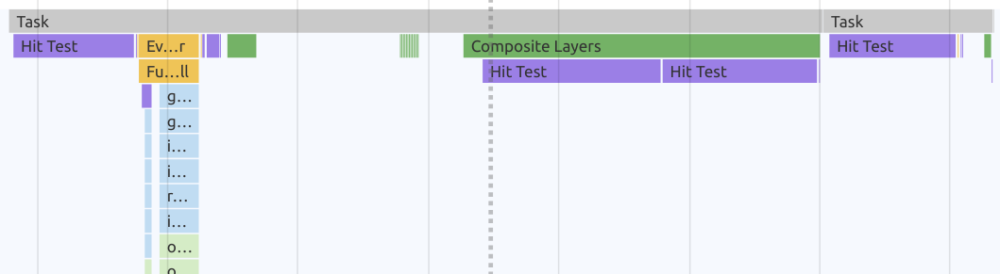
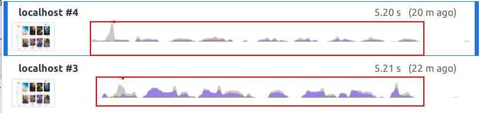
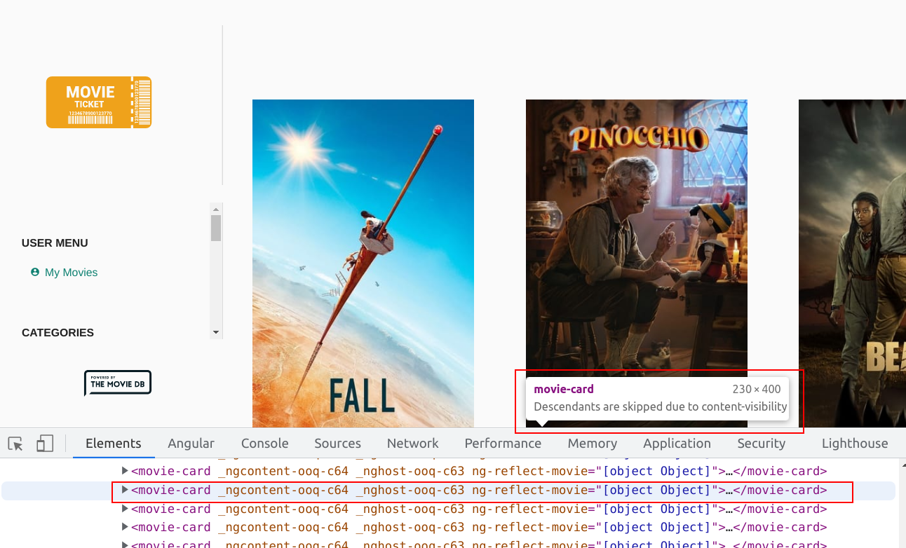

# CSS Performance - content-visibility

Until now, we've tried to reduce the work the browser has to perform on DOM interaction by proactively
dividing our applications template into layoutable areas.
Anyway, scrollable growing containers are not going to benefit from this solution. The more content
it contains, the higher the layouting effort will be for the browser.

A common solution to this problem is to use `virtual-scrolling`. For dynamic masonry/grid-like
layouts you will have a hard time finding a proper javascript based solution, though.
However, there are still options to improve heavy content containers and reduce its layouting cost.

## Native Virtual Scrolling for MovieList

### 0. Measure current state

Start off by measuring the runtime performance of any movie-list with **small contents** & **large contents**.
The movie list grows when you scroll down to trigger the pagination.

We want to do two measurements for comparison, one with a small list (no pagination), one with a large list (> 5 pages loaded).
Do a measurement of the `tilt` animation as well as measure the performance of the task
whenever items are added as a result of the pagination for both of the states.

If you compare the two measurements created with small and large amounts of content, you will
immediately spot the difference in terms of executed work. Below you find screenshots of
example measurements. You should see similar results.

**Small List**

**Large List**

**Comparison**

### 1. Improve with content-visibility

Now it's your task to implement a css based solution to improve the performance even in situations
where the user has loaded a lot of movies to the DOM.

Assign `content-visibility: auto;` to the `movie-card` in order to make use of the browser
native virtual-scrolling.

> Tip: don't forget about `contain-intrinsic-size` :)

Repeat the measurements from before with a small and a large list.

If you've done right, you should notice that the amount of DOM Nodes isn't affecting the runtime
performance anymore.

This is the case because every item out of viewport will be detached from the RenderTree.
The browser will even give a hint about that. Try to select an out-of-viewport item via the
`Elements` panel in the dev tools.

Well done! You've successfully implemented a native virtual scrolling solution :-)
