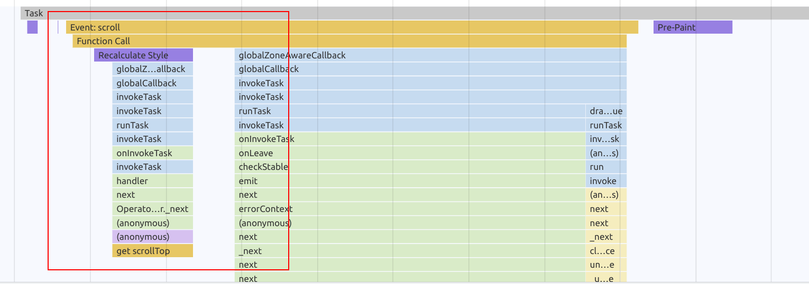
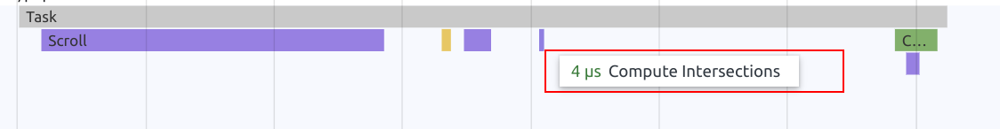

# CSS Performance - ResizeObserver & Forced Reflows

In this exercise you will learn how to measure & avoid unnecessary forced reflows. You will implement a
push-based architecture by leveraging advanced DOM APIs, the [IntersectionObserver](https://developer.mozilla.org/en-US/docs/Web/API/IntersectionObserver).

## 1. Improve Pagination

### 0.1 Measure the current state

Start off by measuring the current state of what happens when you are scrolling in the movies-list in order to trigger the
pagination.

Open your browser to any movie-list page and start the dev tools with `F12` or `Ctrl + Shift + I`.

Do a recording of the scroll event and inspect the flame charts.

> [!NOTE]
> This can be **extremely hard to spot**. As we've learned already - a forced reflow only happens when the layout is in an instable state
> at the time requesting dimensional information.
> In this case, you should be able to spot a scroll event listener happening directly after new nodes where inserted into the DOM. 
> You could also try to **zoom** while scrolling. 

It's totally fine if you can't find it. You should still be able to follow the exercise and learn something on the go ;).


You should be able to spot a pattern that indicates layout thrashing caused by reading the `scrollHeight` property in javascript.



### 1.1 Use the intersection observer: get rid of the DOM access

Your task is to get rid of the forced reflow. The current implementation relies on querying positional and geometrical information
from DOM elements on each `scroll` event. Use the `IntersectionObserver` to implement a push-based architecture which gives you
information about the visibility of an element.

Implement your changes in the `ElementVisibilityDirective`.
Replace the `scroll` event listener with an `IntersectionObserver` implementation. Whenever the element is `isIntersecting`,
we want to send the result by notifying the `visible` signal.

`this.signals.visible(events[0].isIntersecting);`

<details>
  <summary>Implement IntersectionObserver</summary>

```ts
// element-visibility.directive.ts

const observer = new IntersectionObserver(events => {
  if (events[0].isIntersecting) {
    this.elementVisible.emit();
  }
}, {
  root: null, // the scrollContainer (document in case of null)
  rootMargin: '100px', // margin
  threshold: 0.5 // how much of the element should be visible before it's considered as intersecting
});

observer.observe(elementRef.nativeElement);
```

</details>

Great job! 

### 1.2 Measure the improvement

If you've finished the implementation, repeat the measurement process. You should notice that the flame graph looks much cleaner now
when scrolling. The scroll listener as well as the forced reflow shouldn't be any issue anymore :).

Instead, you should find tasks that are labelled as `compute intersections`.


