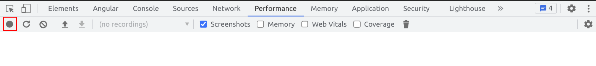
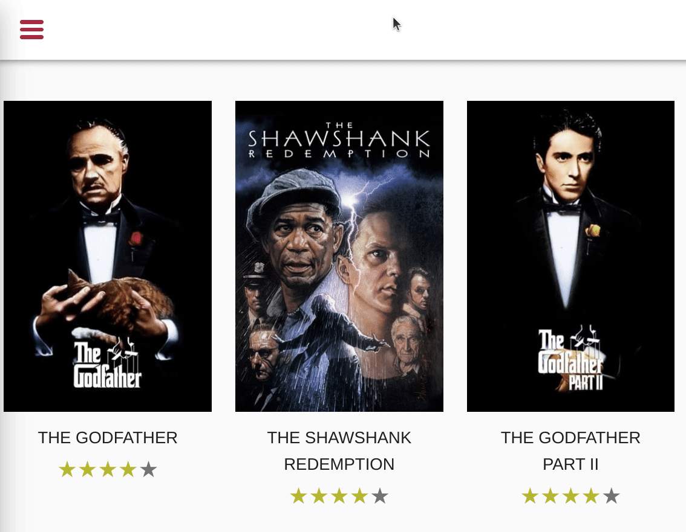
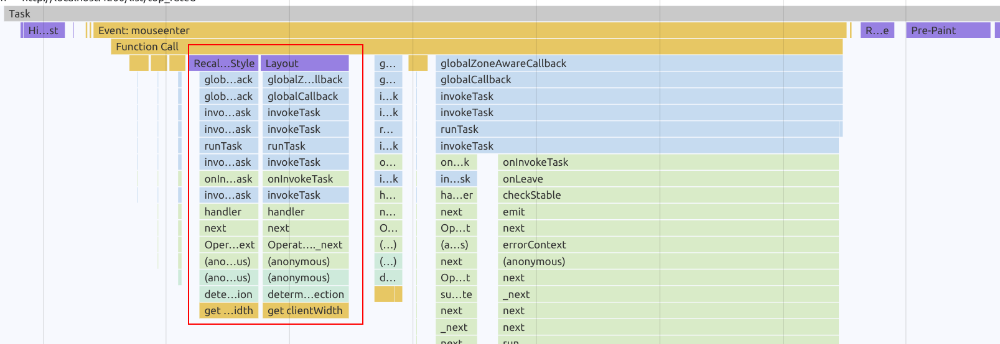

# CSS Performance - ResizeObserver & Forced Reflows

In this exercise you will learn how to measure & avoid unnecessary forced reflows. You will implement a
push-based architecture by leveraging advanced DOM APIs, the [ResizeObserver](https://developer.mozilla.org/en-US/docs/Web/API/ResizeObserver).

## 1. Improve Tilt Directive

### 1.0 Measure current state

Start off by measuring the current state of the animation that tilts the `movie-card` on hover.
Open your browser to any movie-list page and start the dev tools with `F12` or `Ctrl + Shift + I`.

Do a recording of the animation and inspect the flame charts.



**Tilt Animation**


When analysing the flame charts, you should notice that there is a `layout` task involved
when querying for `getBoundingClientRect` or `clientWidth`.



### 1.1 Implement ResizeObserver

Your task now is to improve the performance of the animation by removing the need for layouting at all.

Go to the `TiltDirective` and make use of the `ResizeObserver` in order to get the dimensions of the directive pushed to in instead
of you having to query for it.

<details>
  <summary>Implement ResizeObserver</summary>

```ts
// tilt.directive.ts

private middle = 0;

constructor() {
  const observer = new ResizeObserver((events) => {
    const width = events[0].contentRect.width;
    this.middle = nativeElement.getBoundingClientRect().left + width / 2;
  });
  observer.observe(elementRef.nativeElement);
}
```

</details>

Feel free to add `console.logs` in order to see that the Observer is actually updating values when you resize the window :).

Now that we have the dimension pushed to us, we can use it in order to determine the direction of the animation.

<details>
  <summary>Adjust position determination</summary>

```ts
// tilt.directive.ts

// use offsetX instead of pageX
// determine position by using the stored width and compare it to the offsetX
const pos > this.middle ? 1 : 0;

```
</details>

**Well done!!**

### 1.2 Measure the improvement

Do the measurement again, you should notice that the forced reflow is completely gone now as we are not querying for
any layout properties.
