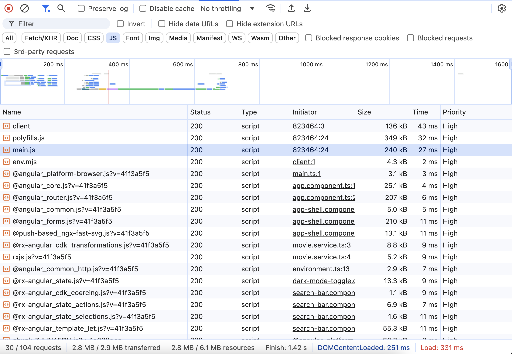
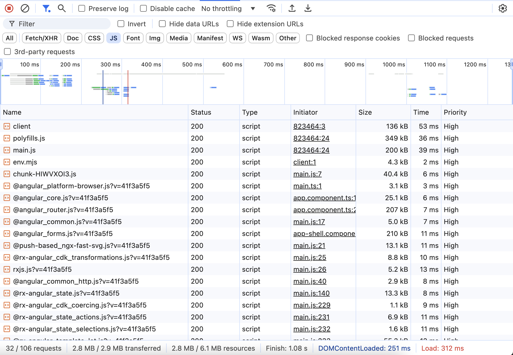

# Lazy loading with @Defer

In this exercise we will use the defer block to improve the loading performance of our application
by lazy loading a component in the template.

## Evaluate Initial State

Let's investigate what is being loaded when we load the details page:

Navigate to a details page by clicking a movie tile or directly navigate by url eg. `http://localhost:4200/movie/823464`.

Open the network tab of the developer tools and inspect the bundles being downloaded on the page.

Identify the bundle being loaded for the detail page and note the size of the bundle.

<details>
  <summary>Initial Network State</summary>

> main.js -> 240kb



</details>


## Use Defer

Open the MovieDetailPageComponent template and locate where MovieListComponent is used in the template.
Use the defer block to lazy load the component.

<details>
  <summary>Defer MovieListComponent</summary>

```angular17html
@defer {
  <movie-list [movies]="recommendations.results" />
}
```

</details>

Now let inspect the changes, open the network tab and reload the page.

Identify which bundles where affected by this change.

<details>
  <summary>Defer MovieListComponent Network State</summary>

> main.js -> 200kb



</details>
