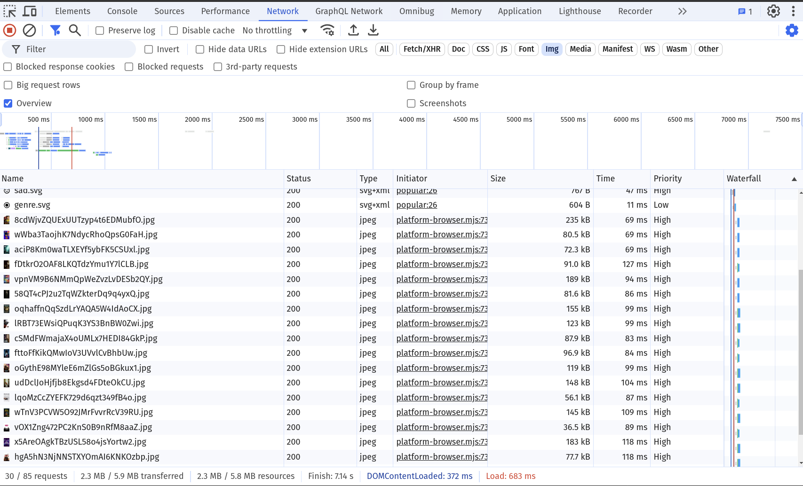

# Network: Lazy Load Resources

## 0. Investigate the current state 

Refresh the app (with / without cache - u probably should try both). 
Also see how the app behaves when throttling is enabled.

If you investigate the network tab you should see all images are loaded eagerly & with high priority.



This is probably not what you want, as it can negatively impact LCP. Especially for slower devices it's always a bad idea to put too much network traffic at once.

## 1. Introduce loading=lazy for movie-card

Use `loading="lazy"` on the `movie-card > img`.

Measure again! You should see how images are now switched in priority and timing.
Also the app behaves different now in terms of rendering.

We probably also negatively impacted LCP with that change. But don't worry, we are going to fix it now!

## 2. Eager load LCP candidate

You probably want to have the first image of the list always rendered eagerly. Use the `index` property to determine which image
should be loaded `loading="eager"`.


<details>
  <summary>Solution: Eager load LCP candidate</summary>

```html


```

</details>

Measure again, your LCP should be improved now. Make sure you don't hit the cache when measuring before/after!


## 3. Prioritize LCP Candidate

You can also put the `[attr.fetchpriority]` here to enforce a high priority on the lcp image, e.g. `index() < 1 ? 'high' : 'low'`.

<details>
  <summary>Solution: Prioritize LCP Candidate</summary>

```html


```

</details>

Measure again, your LCP should be improved now. Make sure you don't hit the cache when measuring before/after!
