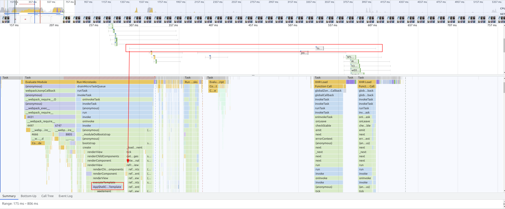
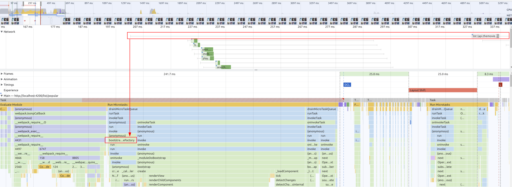

# Network: Prefetch LCP Data

## 1. Prefetch http resources as early as possible

Until now, we used native browser features in order to preload/prefetch **static** resources in an early stage.
But what about dynamic resources or resources where we need authentication upfront?
Let's first inspect current state.
Right now the network requests needed to display any meaningful data to the user are tied to component lifecycles. 
This is in general a very bad practice as it is the latest point in time when we actually can execute scripts.

We can observe this behavior by looking from two different angles, the code and the performance analysis.

Start by looking at the code and go to the `AppShellComponent`. You should find a code snippet that requests the `genre` data from the 
`MovieService` and bind it to an `async` pipe in the template.

<details>
  <summary>Show snippet</summary>

```ts
// app-shell.component.ts

readonly genres$ = this.movieService.getGenres();
```

```html
<!--app-shell.component.html-->

<a
  [attr.data-uf]="'menu-gen-'+genre.id"
  *ngFor="let genre of genres$ | async;"
  class="navigation--link"
  [routerLink]="['/list', 'genre', genre.id]"
  routerLinkActive="active"
>

```
</details>

This is a clear indicator for a bad practice, as we start fetching data when the template of
our component gets evaluated.

Let's look at it from the performance analysis.

Open the Performance Tab of the dev tools and start a recording with `Ctrl + Shift + E`.
This will refresh the page and provide you the performance analysis data afterwards.

Go to the `Network` section and search for the request made to
`https://api.themoviedb.org/3/genre/movie/list`. Take a look at the timing when it is queued.

By combining this view with the flame-chart view, you should be able to pinpoint the exact 
location where the request is made in the code: `AppShellComponentTemplate`.



As we now found out where the problem is, let's find a solution.
Your goal is to provide and implement an `APP_INITIALIZER` where we 
will pre-fetch the genre data of the `MovieService`.

For this, we first need to touch the `MovieService` as well as the `AppShellComponent`.

Let's go ahead and introduce a `genre$: Observable<TMDBMovieGenreModel[]>`
as a field in the `MovieService`.
You can also delete the method `getGenres()` as we don't need it anymore.

The `genre$` observable should get assigned to the http call being made before
in `getGenres()`.

The final trick will be to add the `shareReplay` rxjs operator the `genres$` Observable,
as we want to pre-fetch it in an early stage and cache it for later re-usage.

In `AppShellComponent` change the access from `getGenres()` to `genre$`.

<details>
  <summary>Show solution</summary>

```ts
// movie-service.ts

readonly genres$ = this.httpClient
  .get<{ genres: TMDBMovieGenreModel[] }>(
    `${environment.tmdbBaseUrl}/3/genre/movie/list`
  )
  .pipe(
    map(({ genres }) => genres),
    shareReplay({ bufferSize: 1, refCount: true })
  );
```

```ts
// app-shell.component.ts

readonly genres$ = this.movieService.genres$;

```

</details>

Now it's time to finally start pre-fetching our resource.
The goal is to implement an `APP_INITIALIZER` that uses the `MovieService`
kickstart the request to the genres endpoint.

For this, we just need to `subscribe` to the `genres$` Observable, as this will
start the http call.

<details>
  <summary>Show solution</summary>

```ts
// app.module.ts

@NgModule({
  /*other stuff*/
  providers: [
    /*other stuff*/,
    {
      provide: APP_INITIALIZER,
      useFactory: () => {
        const movieService = inject(MovieService);
        return () => {
          // start the http call
          movieService.genres$.subscribe();
        };
      },
      multi: true,
    },
  ]
})
export class AppModule {}
```

</details>


Well done, it's time to validate our improvements!
Repeat the analysis process from before by doing a performance profile of a refresh.

You should now see the timing of the network request has moved from `AppShellComponentTemplate` to
`bootstrap`, very nice job!!


