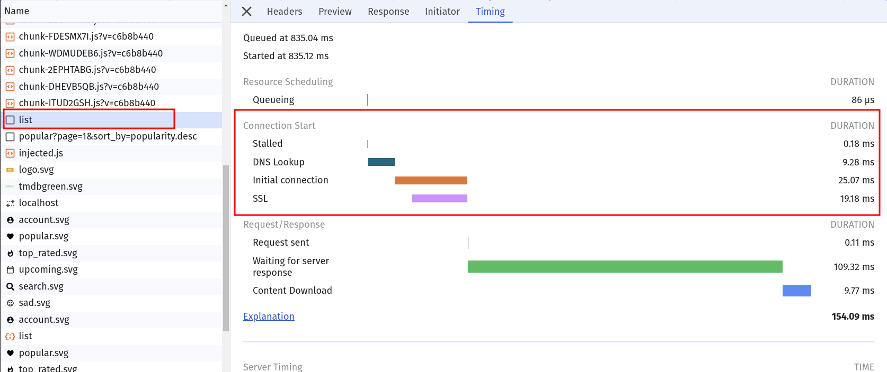
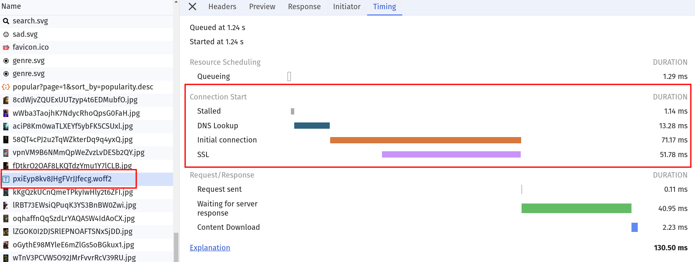
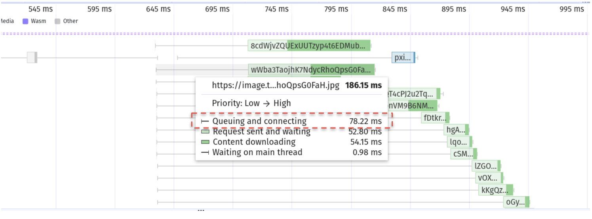
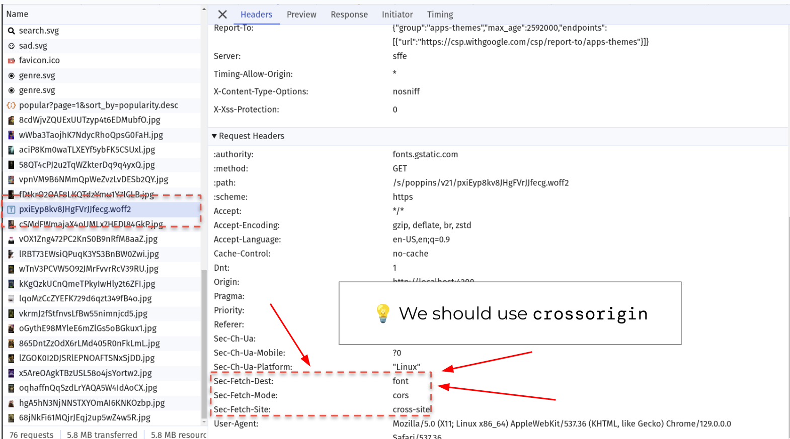

# Network: Resource Hints: Preconnect

For our applications it's essential to fetch data as fast as possible. 
For origins where we know that we want something from them, but don't know exactly what yet, we can use the `preconnect` resource hint.
One stage of every network request is `connection`. We can tell the browser to pre-emptively establish
a connection (DNS lookup, TLS, ...) to a given origin with `preconnect` technique.

This will ultimately improve the LCP for our application.

## 0. Measure current state

> [!NOTE]
> It is quite important for this exercise to always measure with a clean cache. Do so
> by either hard disable the cache in the network tabs settings, or always make sure
> to refresh by emptying cache and hard reload.
> It's always very helpful to do the measurements in **incognito mode**   
> It might even be necessary to have an **entirely fresh** incognito browser session each
> time you want to measure connection times.


> [!NOTE]
> **MEASURING THIS EXERCISE IS PAINFUL!!!** Unfortunately the chrome dev tools
> are no good option to measure the impact of `preconnect`. However, you can def.
> measure that requests are connecting and it takes time. The improvement of `preconnect`
> is not really measurable. 


The Movies app is based on [The Movie Database (TMDB)](https://www.themoviedb.org/) API.
We know for sure that user will need: 
* `https://image.tmdb.org/` -> images
* `https://api.themoviedb.org/` -> API requests

On top of it, we are using the google font API:
* `https://fonts.googleapis.com` -> font css definitions
* `https://fonts.gstatic.com` -> font files

### 1. Network Tab

Perform a measurement in the network tab. Look out for the requests matching the origins
mentioned above. You should be able to spot connection times (when coming with a fresh browser).

<details>
  <summary>Hint: what to lookout for</summary>





</details>

### 2. Performance Tab

Restart your incognito window again - to have clean state. Now rerun a measurement, but this
time with the Performance panel.

Again, look out for the same origins mentioned above and take a look at the candles of the requests. 
You should be able to spot a huge connection time for some of the requests.

<details>
  <summary>Hint: what to lookout for</summary>



</details>

## 1. Use `preconnect` to preemptively connect

Your task is to improve the http connection time by using `<link rel="preconnect" />` tags in the `index.html`
files `head` for the four known resources.

Remember how to figure out if you need `crossorigin` or not? Try to figure out yourself before copy/pasting!

Here is another hint what to look out for:


<details>
  <summary>Hint: what to lookout for</summary>



</details>

<details>
    <summary>show solution</summary>

Go to `index.html` and extend `<head>` tag with following:

```html
<!--index.html-->

<link rel="preconnect" href="https://api.themoviedb.org" crossorigin>
<link rel="preconnect" href="https://image.tmdb.org">
<link rel="preconnect" href="https://fonts.googleapis.com">
<link rel="preconnect" href="https://fonts.gstatic.com" crossorigin>
```
</details>

Sadly, the outcome of this improvement isn't really measurable with the current application setup :-(.

But, you can still try ;-). Maybe you know a different tool that helps us?
