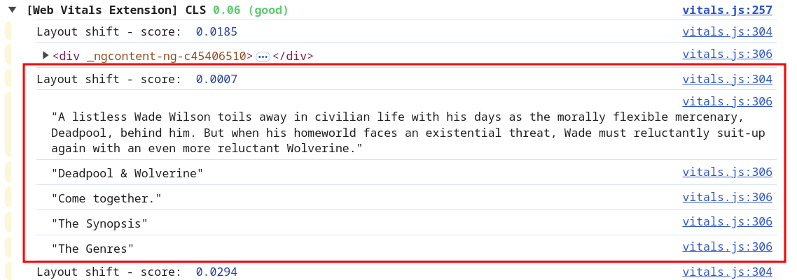
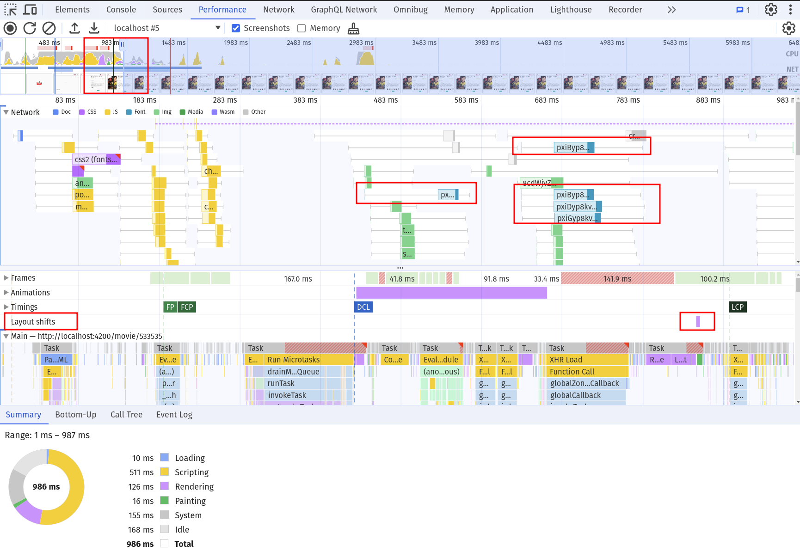
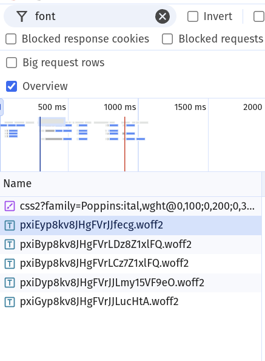
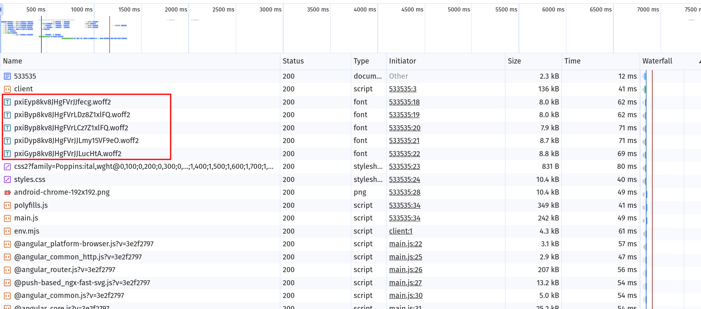
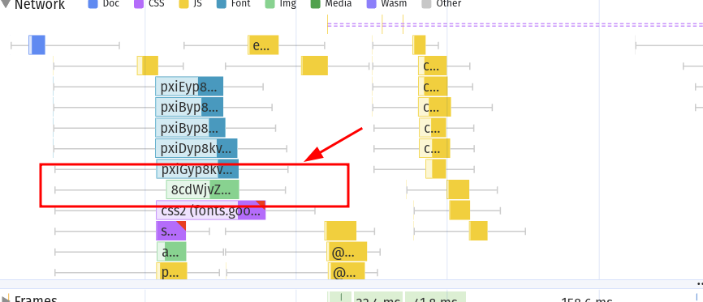
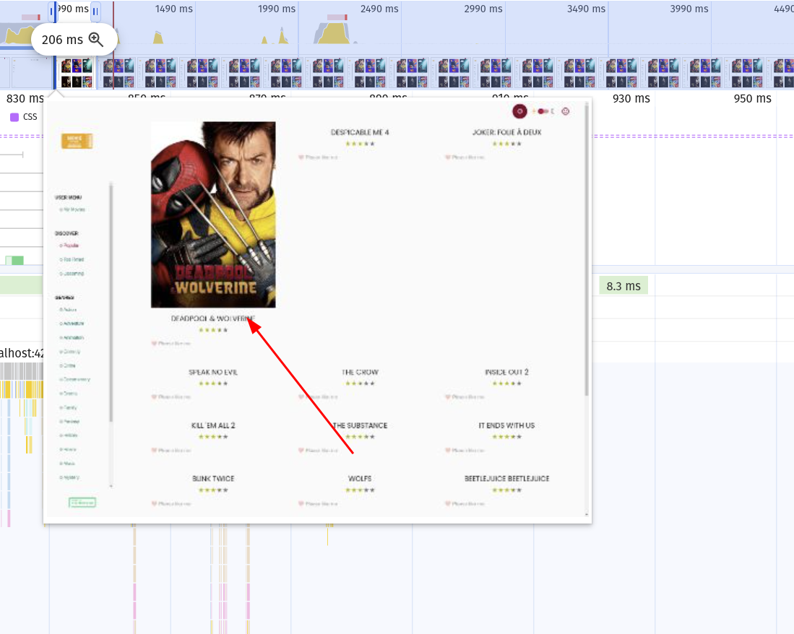
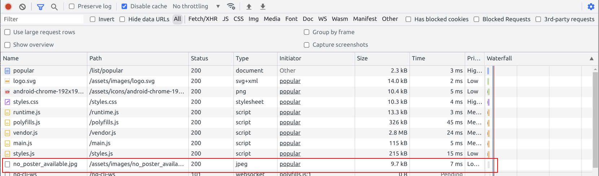

# Network: Resource Hints: Preload & Prefetch

For our applications it's essential to fetch data as fast as possible.
For origins where we know what we want from them already upfront, we can use the `preload` & `prefetch` resource hint.
This allows the browser to download critical information right away.

This will ultimately improve the LCP & sometimes CLS for our application.

## 0. Measure the current state

Get aware of the resources our browser needs to have a stable and fast first paint.

### 0.1. Measure CLS

Use the web vitals extension to see CLS problems on one of the movie detail pages, e.g. `http://localhost:4200/movie/533535`.

You should notice it reports a bunch of `text` nodes that jump around.



To figure out the reason you might want to do a recording with the performance panel.

You should be able to spot a connection from downloaded fonts to the jump in the UI.
Use the `screenshots` layer & the `network` track to properly see it.

Also, always make sure to refresh the page without cache!



### 0.2. Measure LCP

The web vitals extension should give you a hint about what is the LCP of one of the list pages, e.g. `http://localhost:4200/list/popular`.
It is most probably the first image of the grid.

Copy the path to that image and note it down!

## 1. Use `preload` to load critical resources

Let's use `preload` to improve our CLS & LCP based on our measurements from before.

### 1.1 Fonts

We know that the lazy loaded fonts cause CLS issues. Go again to the movie-detail page
you've analyzed before, e.g. `http://localhost:4200/movie/533535`.

Search for the `fonts` that are being downloaded for the page and write them down.



<details>
  <summary>Hint: list of fonts</summary>

```text

https://fonts.gstatic.com/s/poppins/v21/pxiEyp8kv8JHgFVrJJfecg.woff2
https://fonts.gstatic.com/s/poppins/v21/pxiByp8kv8JHgFVrLDz8Z1xlFQ.woff2
https://fonts.gstatic.com/s/poppins/v21/pxiByp8kv8JHgFVrLCz7Z1xlFQ.woff2
https://fonts.gstatic.com/s/poppins/v21/pxiDyp8kv8JHgFVrJJLmy15VF9eO.woff2
https://fonts.gstatic.com/s/poppins/v21/pxiGyp8kv8JHgFVrJJLucHtA.woff2

```

</details>


For each of those links, create a `link rel="preload" href="{{font}}" as="font" type="font/woff2" crossorigin` and add it to the
`index.html` of your app.

<details>
  <summary>Solution: preloaded fonts</summary>

```html

<link rel="preload" href="https://fonts.gstatic.com/s/poppins/v21/pxiEyp8kv8JHgFVrJJfecg.woff2"
      as="font" type="font/woff2"
      crossorigin />
<link rel="preload" href="https://fonts.gstatic.com/s/poppins/v21/pxiByp8kv8JHgFVrLDz8Z1xlFQ.woff2"
      as="font" type="font/woff2"
      crossorigin />
<link rel="preload" href="https://fonts.gstatic.com/s/poppins/v21/pxiByp8kv8JHgFVrLCz7Z1xlFQ.woff2"
      as="font" type="font/woff2"
      crossorigin />
<link rel="preload" href="https://fonts.gstatic.com/s/poppins/v21/pxiDyp8kv8JHgFVrJJLmy15VF9eO.woff2"
      as="font" type="font/woff2"
      crossorigin />
<link rel="preload" href="https://fonts.gstatic.com/s/poppins/v21/pxiGyp8kv8JHgFVrJJLucHtA.woff2"
      as="font" type="font/woff2"
      crossorigin />

```

</details>


Well done! Go and do a re-measurement. You should be able to see how the timing of the network requests have changed. They now
should appear as the first ones.



If something is wrong with preloading, the console should give you a warning about it and also suggest improvements.

### 1.2 LCP Image (hacky ;))

Okay, this will be quite a hacky one. But it'll do the trick for now - and could potentially
be optimized in future, so it's not worthless :).

I hope you've noted down the path to the LCP on the list page you've analyzed.

For that LCP image, also create a `link rel="preload" as="image" href="{{ path-you-noted }}"` and insert it into the 
index.html.

<details>
  <summary>Solution</summary>

```html
<link rel="preload" href="{{ your image that youve noted down }}" as="image" />


```

</details>

If you've succeeded you should be able to confirm it via the Network dev tools & a performance
recording.



You should also see an improvement in LCP, as the image is now already downloaded before it's being
requested :). 



The improvement is probably minor with the current setup. It will be more prominent on
slower networks (you could throttle if you like).

## 2. Use `prefetch` to preemptively fetch resources

You can use `prefetch` to make a hint to the browser that the resource will be needed for other pages.
Links with this attribute will be preemptively fetched and cached by the browser.
We need a backup image for movies that don't have a poster so let's fetch it.

Your task is to `prefetch` the `assets/images/no_poster_available.jpg` image by
using `link` tag.

Add it to the `index.html` files `head` tag.

<details>
    <summary>show solution</summary>

Go to `index.html` and extend `<head>` tag with following:

```html
<!-- index.html -->

<link rel="prefetch" href="assets/images/no_poster_available.jpg" />
```

</details>

Great, you can verify your changes by inspecting the network traffic of your application on a refresh.

You should see that the request for the prefetched resource is happening right after the javascript bundles are loaded.



If you make sure that `no-poster-avilable` is actually being displayed, you will also be able
to see the network tab requesting it from the cache.
