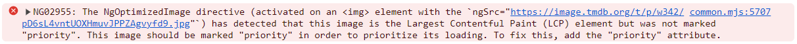

# NgOptimizeImages

In this exercise you will learn how to optimize images using the NgOptimizeImages Directive.

## 1. Using ngSrc 

Start by adding the directive to an image tag.

- Replacing the `src` attribute with `ngSrc`
- Make sure images have a `height` and `width`

<details>
    <summary>show solution</summary>

Go to `movie-card.component.html` and modify the img tag to contain following changes:

```html
  
```
</details>

Now if you open the browser console you should see that we are getting an error message.



This error is because we did not tell NgOptimizedImage if it should prioritize the image or not. 
To fix this, add the `priority` attribute to the `img` for the two first images.  

<details>
    <summary>show solution</summary>

Use the index from the movie list to set the priority of the image in the movie card.

```html
  
```
</details>

After this change the error should be gone from the console.

See how the ngOptimizedImage directive added `eager` loading and `fetchpriority=high` to the LCP image. 🚀🚀🚀

## 2. srcSet for optimized asset fetching

DRAFT:

### 2.0 setup IMAGE_LOADER

<details>
  <summary>IMAGE_LOADER setup</summary>

```ts
// app.config.ts

{
  provide: IMAGE_LOADER,
    useValue: (config: ImageLoaderConfig) => {
  return `https://image.tmdb.org/t/p/w${config.width ?? 300}${config.src}`;
},
},

```

</details>

### 2.1 configure ngSrcSet

get rid of the `| movieImage`.

<details>
  <summary>ngSrcSet configuration</summary>

```html


```

</details>


Great! Measure the impact:

* check for the LCP image (copy the file name)
* open the network tab and search for that image
* `toggle device toolbar`
* refresh the app
* start with either a small screen or large screen and adjust its size (and DPR) to test the outcome


