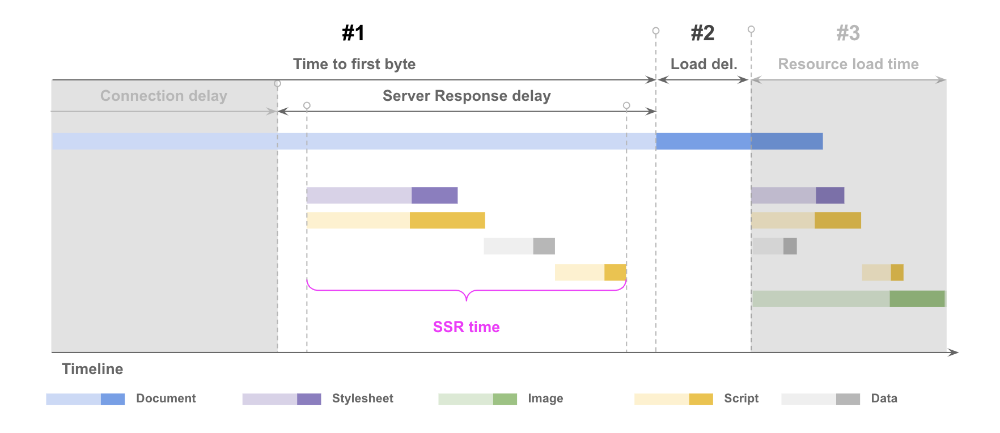
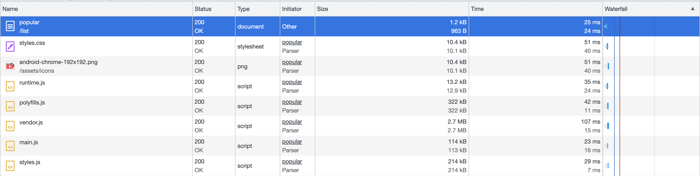
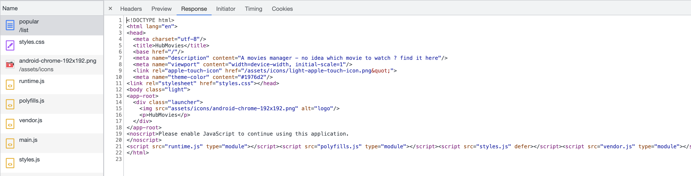
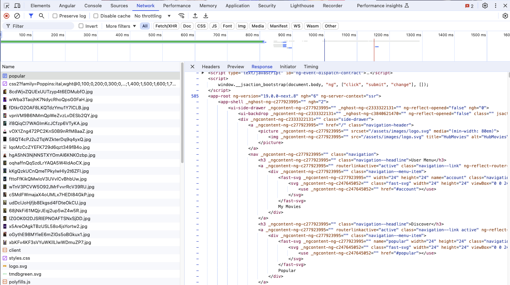
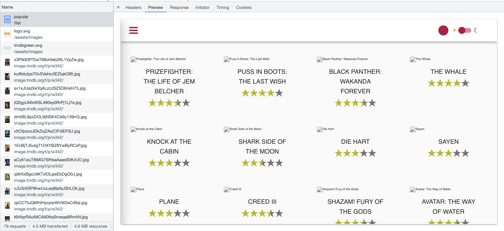
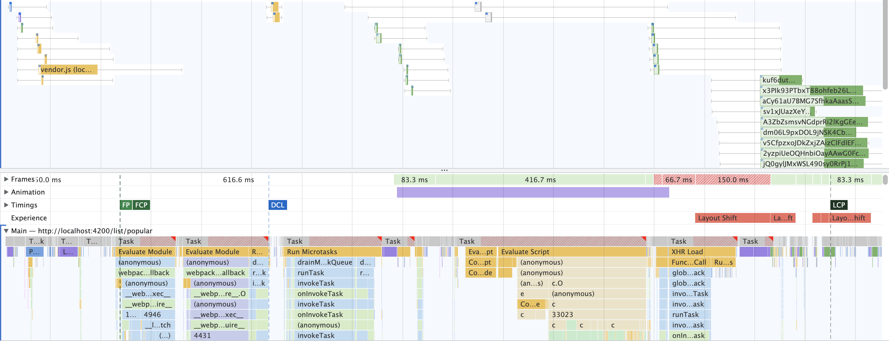
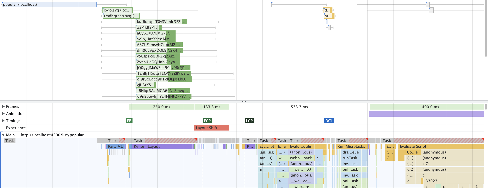
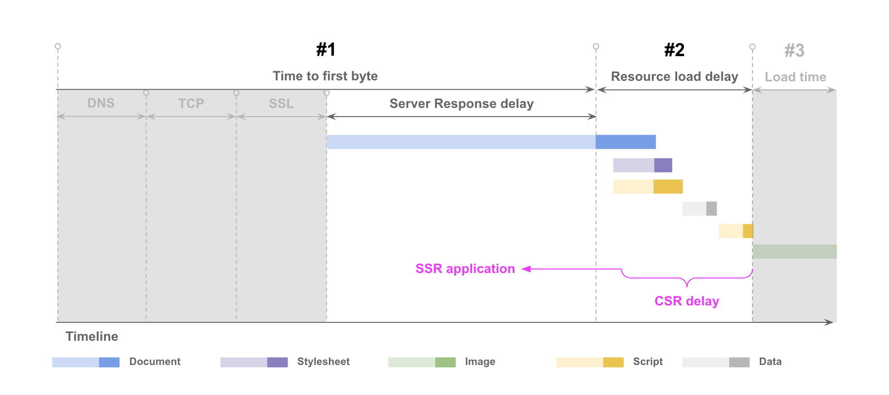
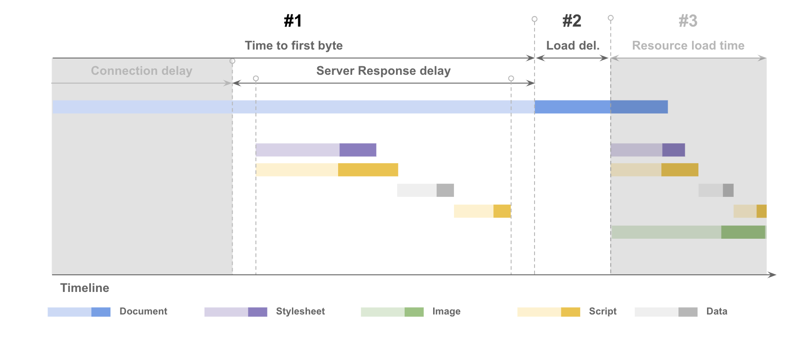

# Angular Server Side Rendering 

In this exercise we will learn how to set up Server Side Rendering using Angular SSR package and fix some of the issues we will encounter.



## 0. Client Side Rendered (CSR)

Start off by measuring the current state. Open your browser to show you any movie list, e.g. `http://localhost:4200/list/popular`.

Open the devtools with `F12` or `Ctrl + Shift + I` and open the `Network Tab`. Create a new Network recording with `Ctrl + R` or by reloading the page.

You should see all the network requests made by the initial navigation.



Open the first request which should be named `popular/list`

You should find that the html document is almost identical the `index.html` located at the root of the application `src/index.html`.



## 0.1 Installing Angular SSR

> [!NOTE]
> This step is already done for you, so SKIP this step.

```bash
ng add @angular/ssr
```

## 1. Enable SSR in the app

- Uncomment `provideClientHydration(withEventReplay()),` in `src/app/app.config.ts`.
  - Import the functions from `@angular/platform-browser`.
- Go to `angular.json` and add the following fields to the `build` configuration:

```json
{
  "build": {
    "builder": "@angular-devkit/build-angular:application",
    "options": {
      // ... other options
      "outputMode": "server",
      "server": "src/main.server.ts",
      "prerender": false,
      "ssr": {
        "entry": "server.ts"
      }
    }
  }
}
```

You should now be able to run the application with `ng serve` and the app will be server side rendered.

> [!IMPORTANT]  
> If you want to close the dev server, press `Ctrl + D` in the terminal. (known issue)


### 1.1 Fix `document is not defined` error

After running the application, you should see the following error:

```
ERROR ReferenceError: document is not defined
    at eval (../ng-perf-ws/src/app/shared/cdk/element-visibility/element-visibility.directive.ts:27:19)
    at _ZoneDelegate.invoke (../ng-perf-ws/node_modules/zone.js/fesm2015/zone-node.js:369:28)
    at ZoneImpl.run (../ng-perf-ws/node_modules/zone.js/fesm2015/zone-node.js:111:43)
    at _NgZone.runOutsideAngular (../ng-perf-ws/.angular/cache/19.0.0-next.8/vite/deps_ssr/chunk-ULH7NJ5N.js:5813:24)
    at _ElementVisibilityDirective (../ng-perf-ws/src/app/shared/cdk/element-visibility/element-visibility.directive.ts:26:17)
```

This tells us that the `document` is not defined in the server environment, so we need to not run that code on the server.

Fix it by running it only in the browser environment using the function that we learned in the presentation.

<details>
  <summary>Run code only in browser environment</summary>

```ts
import { afterNextRender } from '@angular/core';

@Directive()
export class ElementVisibilityDirective {
  constructor() {
    afterNextRender(() => { // 👈️👈️👈️
      fromEvent(document, 'scroll')
        .pipe(/* ... removed for brevity */)
        .subscribe(() => {
          // ... removed for brevity
        });
    });
  }
}
```

</details>

This should fix one of the issues we have on the page.

Open the Terminal and check for the next error:

```json
ReferenceError: window is not defined
    at SvgLoadStrategyImpl (../ng-perf-ws/.angular/cache/19.0.0-next.8/vite/deps_ssr/@push-based_ngx-fast-svg.js:73:47)
    at _SvgRegistry (../ng-perf-ws/.angular/cache/19.0.0-next.8/vite/deps_ssr/@push-based_ngx-fast-svg.js:116:11)
    at Object.SvgRegistry_Factory (../ng-perf-ws/.angular/cache/19.0.0-next.8/vite/deps_ssr/@push-based_ngx-fast-svg.js:193:14)
    at eval (../ng-perf-ws/.angular/cache/19.0.0-next.8/vite/deps_ssr/chunk-ULH7NJ5N.js:3471:35)
```

### 1.2 Fix `window is not defined` error
As we learned in the presentation, sometimes third party libraries require additional configuration to work on the server.
In our case, we need to configure the ngx-fast-svg library to work on the server.

Create a SSR load strategy for the `ngx-fast-svg` library and configure it to work on the server.

<details>
  <summary>Configure the ngx-fast-svg library</summary>

```ts
import { isDevMode } from '@angular/core';
import { provideFastSVG, SvgLoadStrategy } from '@push-based/ngx-fast-svg';
import { Observable, of } from 'rxjs';
import { readFileSync } from 'node:fs';
import { join } from 'node:path';

@Injectable()
export class SvgLoadStrategySsr implements SvgLoadStrategy {
  load(url: string): Observable<string> {
    let iconPath: string;
    if (isDevMode()) {
      // In dev mode, we load the SVG from the file system
      iconPath = join(process.cwd(), 'src', url);
    } else {
      // In production, we load the SVG from the build folder
      iconPath = join(process.cwd(), 'dist', 'ws-ng-perf', 'browser', url);
    }
    return of(readFileSync(iconPath, 'utf8'));
  }
}


const serverConfig: ApplicationConfig = {
  providers: [
    // ... removed for brevity
    provideFastSVG({ // 👈️️ configure the ngx-fast-svg library
      svgLoadStrategy: SvgLoadStrategySsr, // 👈️ add the SSR load strategy
      url: (name: string) => `assets/svg-icons/${name}.svg`,
    }),
  ],
};
```

</details>

### 1.3 Fix last `window is not defined` error
In the console, we should see the last error: 

```
ERROR ReferenceError: window is not defined
    at toggleTheme (../ng-perf-ws/src/app/ui/component/dark-mode-toggle/dark-mode-toggle.component.ts:50:7)
    at eval (../ng-perf-ws/.angular/cache/19.0.0-next.8/vite/deps_ssr/chunk-YDWMFPC4.js:8546:78)
```

Fix the issue, by using the same approach we followed in the first step. 

<details>
  <summary>Fix the issue</summary>

```ts
import { afterNextRender } from '@angular/core';

@Component(/*...*/)
export class DarkModeToggleComponent {
  constructor() {
    // ... removed for brevity

    afterNextRender(() => {
      this.hold(this.isLightTheme$, this.toggleTheme);
    });
  }
}
```

</details>

Great job! You shouldn't see any more errors on the terminal.

### 1.4 Check the result

Open the devtools with `F12` or `Ctrl + Shift + I` and open the `Network Tab`. Create a new Network recording with `Ctrl + R` or by reloading the page.

You should see the following:



This means that the `index.html` file is being served with the content from the server.

## Comparison of CSR and SSR

Now that SSR is set up you can run a new network recording and compare the results. You should see that the html delivered already has the movies list rendered in html.



You can also see that the LCP images are being downloaded and rendered earlier.

| BEFORE                                                                 | AFTER                                                                   |
|------------------------------------------------------------------------|-------------------------------------------------------------------------|
|  |  |
|      |   |
