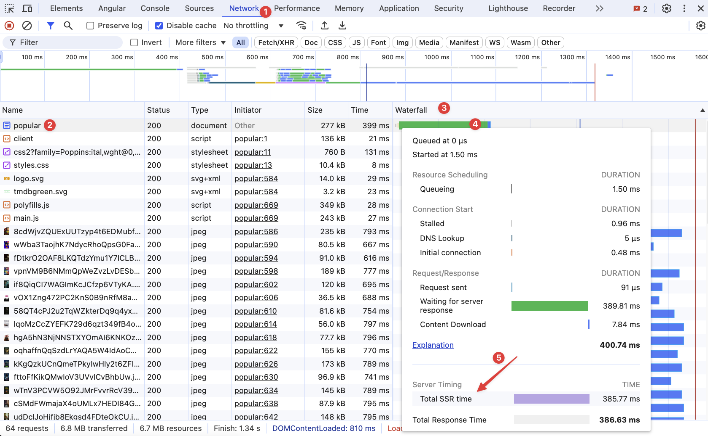
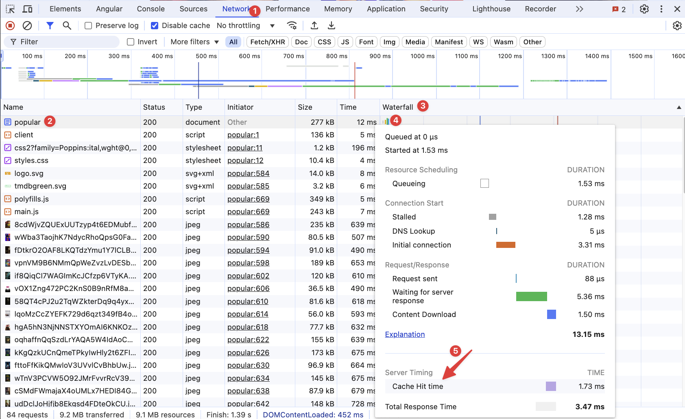

# Angular Server Side Rendering - InMemory Caching & Server Timing

In this exercise we will learn how to improve the performance of our SSR application by implementing a simple in-memory cache and testing the impact using the Server Timing API.

## 1. Server Timing 
In order to measure the impact of the cache, we will use the Server Timing API.

### 1.1 Install the `server-timing` package:

```bash
npm install server-timing --force
```

### 1.2 Use the `server-timing` package in the `server.ts` file

```diff
+ import serverTiming from 'server-timing';

export function app(): express.Express {
  const server = express();
  //... removed for brevity
  
+  server.use(serverTiming());

  server.get('**', (req, res, next) => {
+   res.startTime('SSR', 'Total SSR time');
    angularApp
      .render(req)
      .then((response) => {
-        return response ? writeResponseToNodeResponse(response, res) : next();

+        if (response) {
+          return writeResponseToNodeResponse(response, res).then(() => { res.endTime('SSR') });
+        } else {
+          res.endTime('SSR');
+          return next();
+        }
      })
      .catch(next);
  });

  return server;
}
```

### 1.3 Start app & Measure the Total SSR time 
Open Browser DevTools and open the Network tab.

Hover over the document in the Waterfall column and see the Total SSR time.



Great job! Now we can measure the impact of the cache.

## 2. Simple In-Memory Caching

In this exercise we will learn how to improve the performance of our SSR application by implementing a simple in-memory cache.

### 2.1 Add the `cache` variable

Inside the `app()` function, create a cache variable (Map<string, Response>).

<details>
  <summary>Cache Variable</summary>

```ts
const cache = new Map<string, Response>();
```

</details>

### 2.2 Add the cache logic
Now, we need to intercept the response after the SSR rendering has finished and add it to the cache.
Also, the moment we get a new request, we need to check if the request is in the cache and return the cached response if it exists.
During, this process, also use the server timing API to measure the time it takes to get the response from the cache.


<details>
  <summary>Cache Logic</summary>


```ts
server.get('**', (req, res, next) => {
  const cachedResponse = cache.get(req.url);
  if (cachedResponse) { // 👈️ check if the request is in the cache
    console.log('cache hit', req.url);
    res.startTime('SSR', 'Cache Hit time');
    
    // 👇 return the cached response (clone to avoid mutating the original response)
    writeResponseToNodeResponse(cachedResponse.clone(), res).then(() => {
      res.endTime('SSR');
      next();
    });
    
  } else {
    res.startTime('SSR', 'Total SSR time');
    angularApp
      .render(req)
      .then((response) => {
        if (response) {
          // 👇 add the response to the cache (add a clone to avoid mutating the original response)
          cache.set(req.url, response.clone());
        }

        if (response) {
          return writeResponseToNodeResponse(response, res).then(() => {
            res.endTime('SSR');
          });
        } else {
          res.endTime('SSR');
          return next();
        }
      })
      .catch(next);
  }
});
```

</details>

### 2.3 Start app & Measure the Cache Hit time
Open Browser DevTools and open the Network tab.

Open `http://localhost:4200/list/popular` in the browser and see how much time it takes to get the response from the cache.



Great job! Now we can measure the impact of the cache.

## 3. Cleaning the cache
One of the most hard things in programming is to know when to clean the cache. 

### 3.1 Add the `clean-cache` endpoint
Create a new endpoint `/clean-cache` that clears the cache (clear the cache variable) and returns a success message.

```ts
server.get('/clean-cache', (req, res) => {
  cache.clear();
  console.log('cache cleared');
  res.json({ success: true });
});
```

To verify that the cache is cleared, open `http://localhost:4200/clean-cache` in the browser and see the response.
After that open `http://localhost:4200/list/popular` in the browser and see the response. It should take longer than before, because the cache is empty.
After another request, the cache should be populated again, and the response should be faster.

Great job! With this simple idea, we can now implement any caching strategy we want.

## 4. Measure LCP & TTFB
Because we are using the cache, let's measure the LCP and TTFB of the SSR application.

With caching, the LCP and TTFB will always be faster, because there is no need to wait for the SSR rendering (as we already have the response in the cache).
And the user can see the content faster!

Follow the steps below: 
- Open Popular Movies in the browser and see the LCP and TTFB. Refresh the page and see the LCP and TTFB again.
- Clear the cache and see the LCP and TTFB again. (Hint: use the `clean-cache` endpoint)
- Refresh the page and see the LCP and TTFB again.
