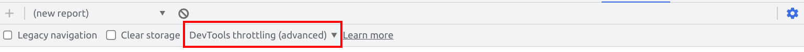
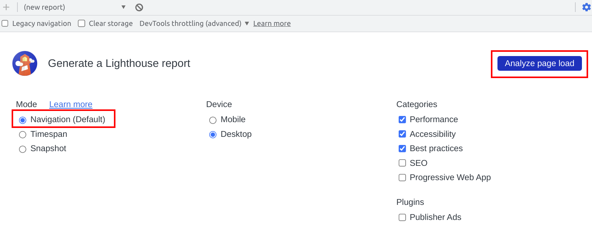
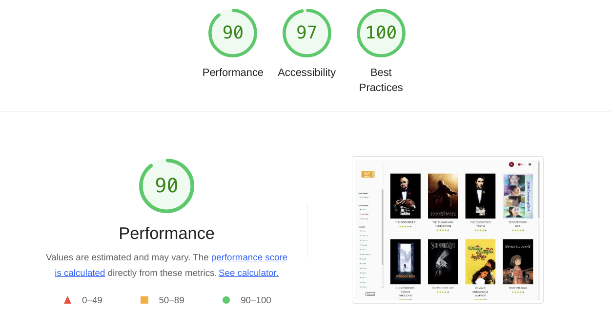
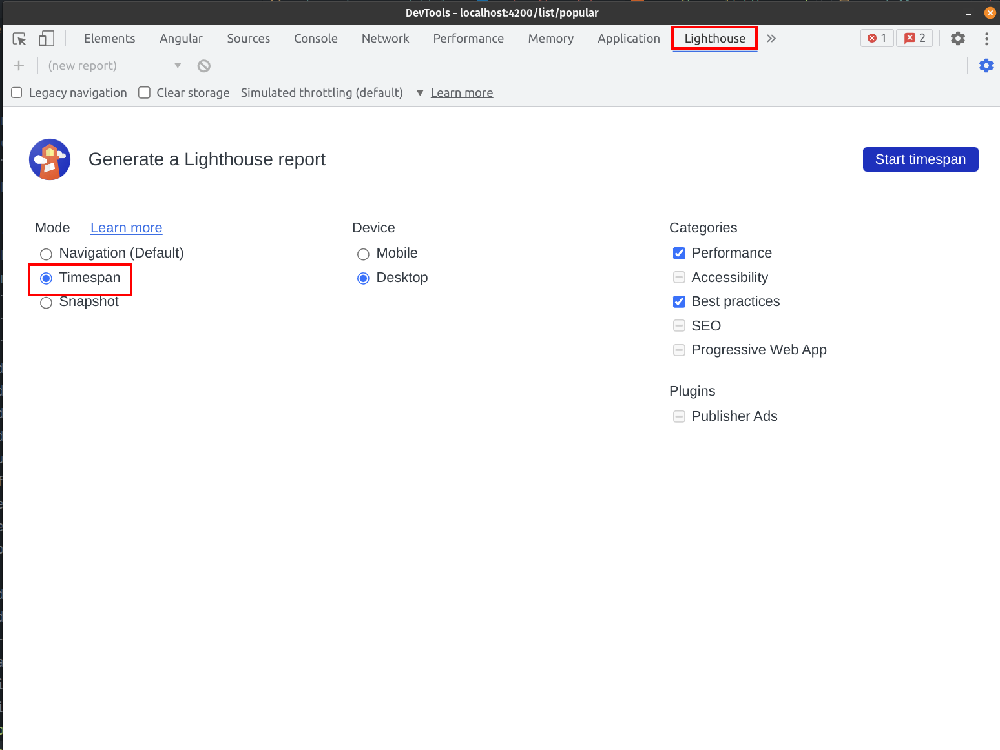
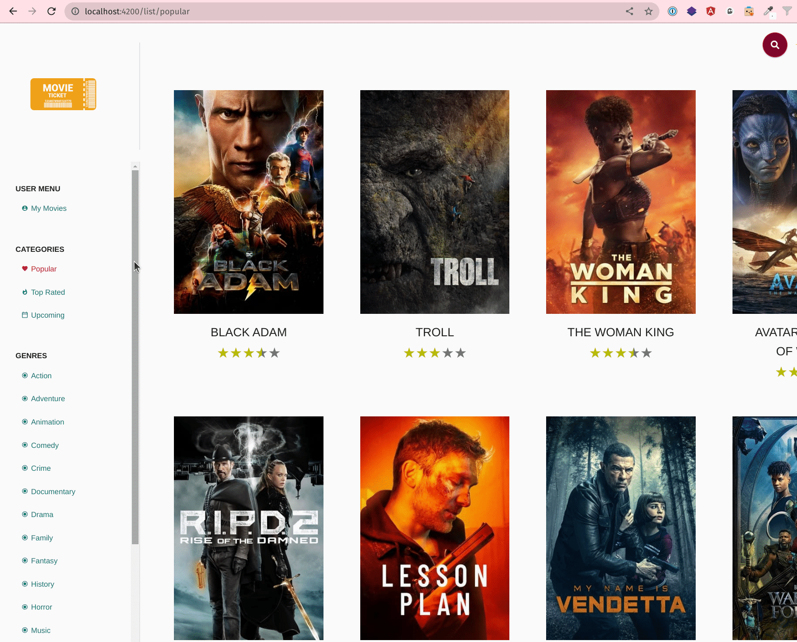
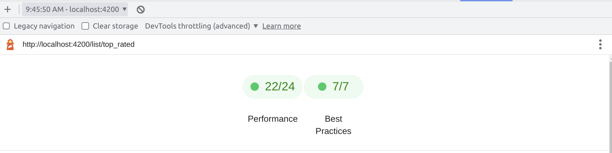
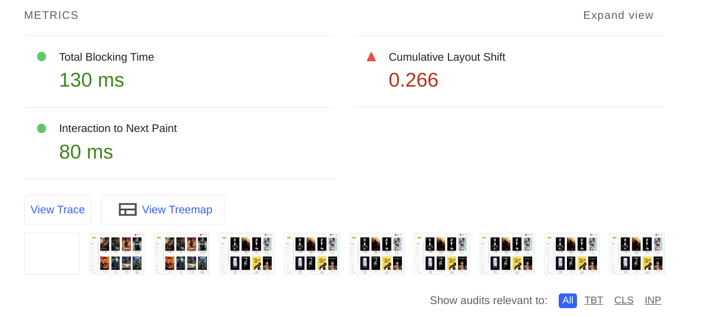
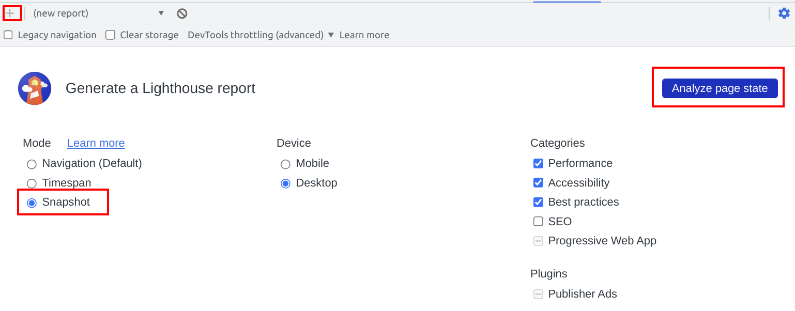
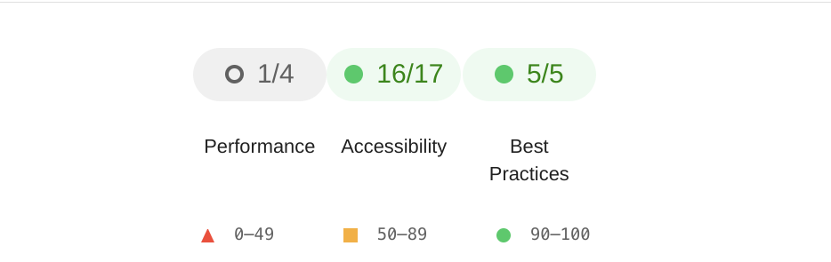

# User Flow - Lighthouse Exercise

The goal of this exercise is to introduce you to the brand new `measurement modes` recently integrated into
the `lighthouse` tool. 
The new `measurement modes` let you record and analyze scripted user behavior as well as snapshots
on running applications.
You will learn how to use the new `measurement modes` `timespan` and `snapshot` recorder tool as well as run and analyze
the outcome in different ways.

We will create the recordings on our locally served application, for this
make sure to run `npm run start`.

## Full User Flow Description

In the next couple of steps you will create audits for a full (simple) user flow.
It will contain an initial `navigation` report, a `timespan` report and a `snapshot`
report, together resembling a cohesive `user flow`.

The flow describes how a user lands on the `Popular Movies` page and
navigates to `Top Rated Movies` page.

Below you find a more detailed description of the user flow:

**navigation**

* navigate to `/list/popular`

**timespan**

* navigate from popular -> top_rated by clicking navigation item
* wait for navigation event to be happened
* wait for movies to be rendered

**snapshot**

analyze current state

## Manual Lighthouse Audits

Let's start with conducting manual `lighthouse` audits in order to get you familiar
with the tool.

## Throttling

You might want to enable `DevTools throttling` which lets u control the applied throttling in your
`DevTools` .

> You also might want to try out multiple throttling settings per task to see how the different steps are behaving
> differently on other devices

## Navigation: popular

Your first task is to create a lighthouse `navigation` audit for the
cold navigation to `/list/popular`.

Open the `lighthouse` tab in the `Chrome DevTools` and select `Navigation` as measurement mode.

To run the audit, press the `Analyze page load` button.

Make sure to run the audit with different throttling modes (network, cpu, mobile) to see a difference
in the measured metrics.

The `navigation` audit reports everything related to the bootstrap of your
application and will give you good hints about how to improve:

* LCP
* FCP
* TBT
* CLS
* ... you name it :-)

You should see an output similar to the following screenshot.

**Congratulations**, you have successfully created a (or multiple) `navigation` audits

## Timespan: popular -> top_rated

Your next task is to create a lighthouse `timespan` audit for the
navigation from `/list/popular` to `/list/top_rated`.
Open the `lighthouse` tool in the `Chrome Dev Tools`, select the `timespan` mode
and navigate to `/list/popular` on the locally served ng movies application.

Prepare yourself for interacting with the application and 
press the `Start timespan` button to create a new timespan audit.

Activate your browser window and navigate to the `top_rated` list by clicking
the item in the sidebar. End the recording after that.

  
Nav to Top Rated

Great, you should see the following outcome.
The `timespan` report will give you information about any measurements that are
runtime related, e.g. the very important metric `INP` which tells you
how long it takes until the application responds after an interaction was done.

**Great!** You've created the first `timespan` report for our user journey.
Inspect the audit results to get familiar with the reporting tool.

> You'll notice that you cannot repeat the steps, we'll come to that later :)

If you like, you can also create a new audit with different throttling setups to see
how the application behaves differently with throttling enabled.

## Snapshot

Let's complete our simple user flow with a `snapshot` audit. Being on the `top_rated` page,
create a `snapshot` audit and analyze the current pages state.

You should see a similar output as the following.
The snapshot mode will provide you information about the current state of the application.
This is usually done after a certain interaction was performed. 

**Great**, now you are aware of how to create a complete user flow analysis by manually
creating audits with all currently available measurement modes of the `lighthouse` tool.
