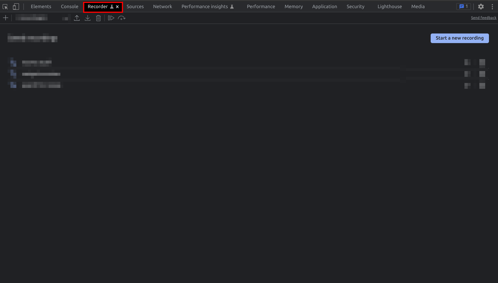
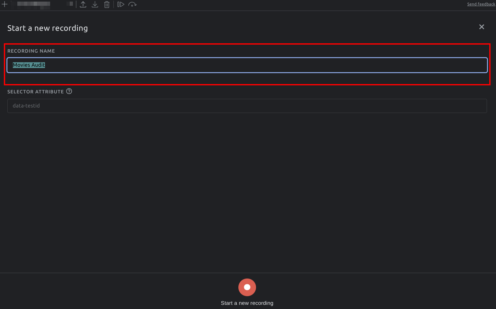
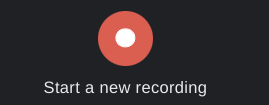
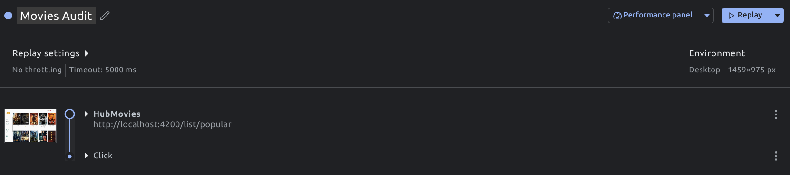
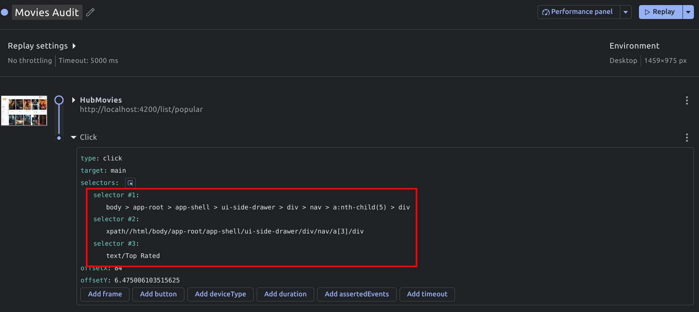
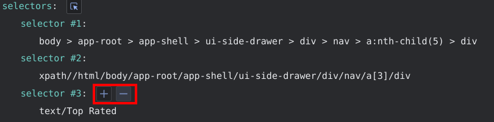
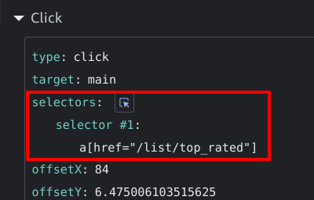
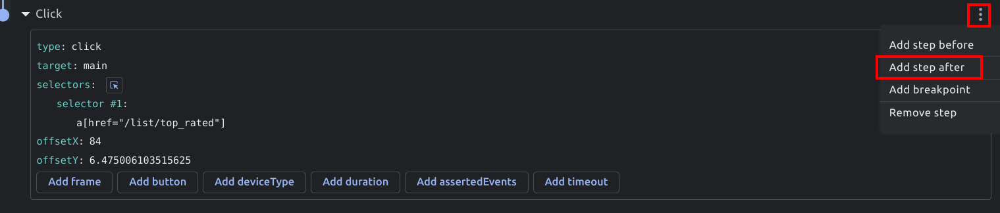
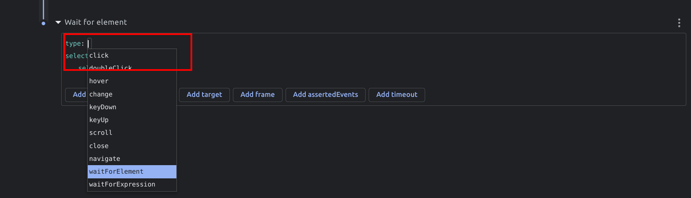
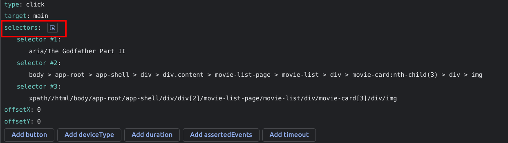

# User Flow - Recorder Exercise

The goal of this exercise is to introduce you to the brand new `recorder` tool of the `Chrome Dev Tools`.
The `recorder` tool lets you record and analyze scripted user behavior on running applications.
You will learn how to create & edit recordings with the `recorder` tool as well as run and analyze
the outcome in different ways.

We will create the recordings on our locally served application, for this
make sure to run `npm run start`.

## 1. Navigation popular -> top_rated

Your first task is to record the navigation from `/list/popular` to `/list/top_rated`.
Open the `recorder` tool in the `Chrome Dev Tools` and navigate to `/list/popular` on
the locally served ng movies application.



Now press the `Start a new recording` or `+` button to start a new recording.

Give it a name and prepare yourself for interacting with the application.



To start the recording, press the `Start a new recording` button on the bottom.



Activate your browser window and navigate to the `top_rated` list by clicking
the item in the sidebar. End the recording after that.

Great, you should see the following outcome:



Validate if the recording is working by selecting the `Replay` button. You can also go
ahead and take a look at the flame charts by selecting the `Performance panel` button.

## 2. Edit Selectors

Expand the `Click` step in the recordings overview pane and inspect the generated selector
for the `click` event. 

You should see a similar outcome to the following:



Those selectors don't look like something we would want to use in an automated e2e environment.

Your task is to remove two selectors so that only one is left over.
Change the last remaining selector to something more reasonable, e.g. `a[href="/list/top_rated"]`.

**Delete Selectors**  



**Edit Selectors**



### Bonus: implement test-selectors

For e2e tests it is common sense and best practice to apply `test selectors` to your DOM Elements
in order to properly select nodes you need in those environments.

Your task is to implement attributes on the navigation items in (`app-shell.component.html`)
to have an easier time selecting the needed items in your recorder.

Typical test attributes are:
* `data-test`
* `data-e2e`
* `data-uf` -> user-flow :)

Of course, after implementing the attributes, use them as selectors in your recording.

<details>
  <summary>Show Solution</summary>

```html
<!--app-shell.component.html-->

<a
  class="navigation--link"
  data-test="top_rated"
  [routerLink]="['/list', 'top_rated']"
  routerLinkActive="active"
>
  <div class="navigation--menu-item">
    <svg-icon class="navigation--menu-item-icon" name="top_rated"></svg-icon>
    Top Rated
  </div>
</a>

```

</details>

Nice, run the recording again and validate if it still runs properly.

## 3. Navigate to Detail

Let's add another step to our existing recording. We don't need to start a new recording,
we can simply use the built in `add step` functionality to build our next step.

Make sure to have the recording selected in the dev tools and you are visiting the 
`/list/top_rated` url in the browser window.

Add a new step by selecting the ellipsis menu in the top right corner of the last `Click` event.



The newly generated step will be of type `waitForElement`. As we want to
kick off another navigation, you want to change that to `click`.



Now we want to tell the recorder which element to click.
Use the `selector` tool to select any `movie-card` you like to navigate to or manually
put in any matching selector.



Of course, the autogenerated selector is not 100% accurate again. Remove all but one selector
and adjust it to something more reasonable, e.g. `movie-card:nth-child(3)`.

Very nice! Run your recording to validate if it's doing what you want.

## 4. Bonus: implement test-selectors

For e2e tests it is common sense and best practice to apply `test selectors` to your DOM Elements
in order to properly select nodes you need in those environments.

Your task is to implement attributes on the movie-card items in (`movie-list.component.html`)
to have an easier time selecting the needed items in your recorder.

Typical test attributes are:
* `data-test`
* `data-e2e`
* `data-uf` -> user-flow :)

Of course, after implementing the attributes, use them as selectors in your recording.

<details>
  <summary>Show Solution</summary>

```html
<!--movie-list.component.html-->

<div class="movie-list" #movieList>
  <movie-card
    (selected)="navToDetail($event)"
    [movie]="movie"
    [attr.data-test]="movie.id"
    *ngFor="let movie of movies">

  </movie-card>
</div>


```

</details>

Nice, run the recording again and validate if it still runs properly.

**Congratulations**, you have successfully created your first synthetic user flow with the
new `recorder` tool.
